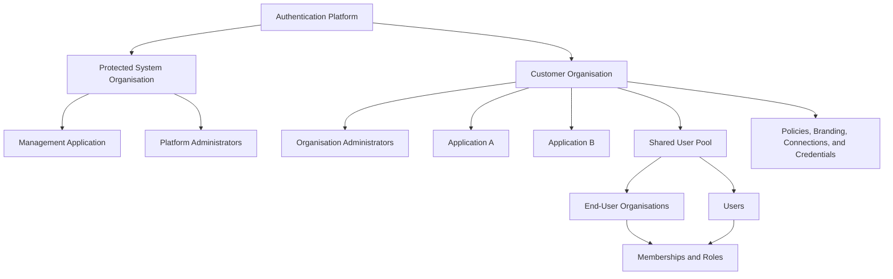

# Authentication Platform — Product and Architecture Overview

## 1. Vision

The goal is to build a multi-tenant authentication and identity platform.

The platform will allow organisations to add secure authentication to their own applications. It will provide:

- Hosted sign-in, sign-up, password recovery, and account-management experiences for end users.
- A management dashboard where organisation administrators can configure applications, users, security settings, and branding.
- APIs and SDKs that applications can use to authenticate users and manage identity data.
- Support for organisations within a customer application, enabling enterprise and business-to-business authentication.
- A protected internal organisation that allows the platform to use its own authentication system.

The long-term aim is for the platform to **power its own authentication**. The management dashboard will be registered as an application in the platform and its administrators will sign in through the same core authentication system offered to customers.

## 2. Core Concepts

### 2.1 Platform

The platform is the complete authentication service. It owns the shared infrastructure, exposes the public APIs, hosts the authentication screens, and enforces tenant isolation.

### 2.2 System Organisation

The system organisation is a permanent, protected organisation created when the platform is first installed.

It exists to hold:

- The platform's own management application.
- Management identities used by customer and platform administrators.
- Internal service and machine identities, where required.
- Platform-level configuration that should not belong to a customer.

The system organisation:

- Cannot be deleted.
- Cannot be transferred to a customer.
- Cannot be disabled through the normal management API.
- Is not included in ordinary customer organisation searches or listings.
- Can only be changed through tightly controlled platform-level operations.

This organisation solves the initial bootstrap problem and allows the platform to authenticate its own administrators.

### 2.3 Customer Organisation

A customer organisation is the top-level tenant for a customer using the platform.

An organisation owns:

- One or more applications.
- One isolated user pool per environment.
- Organisation administrators and their roles.
- Authentication and security policies.
- Branding and hosted-screen configuration.
- API keys, secrets, and machine-to-machine clients.
- Connections to external identity providers.
- End-user organisations and memberships.
- Audit logs and usage information.

All organisation-owned data must be isolated from every other organisation.

### 2.4 Organisation Administrators

Organisation administrators are the people who access the management dashboard to configure an organisation and its applications.

An administrator may belong to any number of customer organisations using a single management identity. Their permissions are defined by a membership and role in each organisation rather than by a single global `is_admin` flag.

After signing in, an administrator selects an **active customer organisation**. They can switch organisation without signing out, but every management request must still verify their membership and permissions in the selected organisation. Switching changes the active tenant context; it does not merge permissions between organisations.

Example management roles include:

- **Owner** — complete control, including billing, administrator access, and organisation settings.
- **Administrator** — manages applications, users, and authentication settings.
- **Developer** — manages applications, API credentials, webhooks, and technical settings.
- **Support** — can inspect users and assist with account issues but cannot change sensitive configuration.
- **Viewer** — read-only access.

Platform administrators are separate from customer organisation administrators. Platform administrators belong to the protected system organisation and can perform platform-level operations.

### 2.5 Application

An application represents a website, mobile app, API, or other product that uses the authentication platform.

The platform will support all major application types, including:

- Traditional server-rendered web applications.
- Single-page applications.
- Native mobile and desktop applications.
- Backend APIs.
- Machine-to-machine services.
- Browserless and input-constrained devices.

Each application can have its own:

- Client identifier.
- Client secret, when appropriate for the application type.
- Allowed callback and logout URLs.
- Allowed origins.
- Token lifetimes.
- Enabled sign-in methods.
- Branding and hosted-screen settings.
- Webhooks.
- API permissions and scopes.

Applications belong to exactly one customer organisation.

### 2.6 User Pool

Each customer organisation has one isolated user pool per environment containing
the identities of people who use that environment's applications.

Applications in the same customer organisation and environment always share
that environment's user pool. This means a user has one identity across all
applications owned by that organisation within development, staging, or
production, while identities never flow between those environments. Application
access and consent are represented separately, so a user existing in the shared
pool does not automatically grant every application access to their identity or
data.

When a user signs up through an application, that application receives the initial access grant as part of sign-up. When the same user signs in to another application in the customer organisation for the first time, the platform must show a consent screen describing the permissions and data requested by that application. The user's decision is recorded as an application grant and can be reviewed or revoked later.

A user record may contain:

- Email addresses and phone numbers.
- Password credentials or passwordless methods.
- Verified identity-provider connections.
- Multi-factor authentication methods.
- Profile data.
- Account status.
- Security and session information.
- Application access grants.
- End-user organisation memberships.
- Custom metadata with clearly defined visibility rules.

User identities in different customer organisations are isolated, even when they use the same email address.

### 2.7 End-User Organisation

An end-user organisation is a group inside a customer organisation's user pool. It represents one of the customer's own business customers, teams, workspaces, or enterprise tenants.

For example, if a project-management company uses this platform:

- The project-management company is the **customer organisation**.
- Its web and mobile products are **applications**.
- People using those products are **users** in its user pool.
- Each company using the project-management product is an **end-user organisation**.

Users can create or join end-user organisations and may belong to any number of them, subject only to customer-configured limits intended to prevent abuse. A user selects an **active end-user organisation** when entering an organisation-aware application and can switch it without signing out. The application must verify membership whenever the active organisation changes.

Permissions are layered. A customer organisation can define reusable default roles, applications can define or override application-specific roles, and memberships assign those roles to users within an end-user organisation. This supports both organisation-wide access and permissions that only apply inside a particular application.

End-user organisations enable features such as:

- Business-to-business and enterprise authentication.
- Team or workspace membership.
- Organisation-specific roles and permissions.
- Domain discovery and verified domains.
- Invitations.
- Organisation-specific single sign-on.
- Enterprise identity-provider connections.
- Just-in-time user provisioning.
- SCIM provisioning in a later phase.

The term **end-user organisation** is used here to avoid confusing these records with the top-level customer organisations that manage the authentication platform.

## 3. Product Surfaces

### 3.1 Hosted Authentication and Account UI

This is the user-facing experience embedded in or linked from a customer's application.

It should support:

- Sign-up and sign-in.
- Email verification.
- Password reset and account recovery.
- Passwordless and social sign-in.
- Multi-factor authentication.
- Consent screens where required.
- Session and device management.
- Profile and credential management.
- End-user organisation selection, creation, invitations, and switching.

Customers should be able to use the hosted UI initially and later replace parts of it with custom screens using the APIs and SDKs.

### 3.2 Management Dashboard

The management dashboard is used by platform and customer organisation administrators.

Customer administrators should be able to:

- Create and configure applications.
- Invite other administrators and manage their roles.
- View, create, suspend, unblock, and delete users.
- Configure sign-in methods and security policies.
- Configure external identity providers and enterprise SSO.
- Manage end-user organisations and memberships.
- Customise branding and hosted screens.
- Rotate API keys and application secrets.
- Configure webhooks.
- Inspect audit logs and authentication activity.
- View usage and billing information.
- Manage development, staging, and production environments.
- Promote or export configuration between environments.
- Configure provider integrations, test connections, rotate credentials, and choose defaults or fallbacks.
- Start a controlled support or impersonation session when permitted.
- Review risk signals, blocked attempts, active sessions, and compromised accounts.

Platform administrators should have a separate, highly restricted area for managing the service itself, customer organisations, system health, abuse, and support operations.

### 3.3 APIs

The backend should expose clearly separated API areas:

- **Authentication API** — sign-up, sign-in, verification, recovery, MFA, sessions, token issuance, token refresh, logout, and OAuth/OIDC flows.
- **End-User API** — account details, sessions, credentials, and end-user organisation memberships.
- **Management API** — organisations, applications, users, connections, roles, credentials, webhooks, and audit logs.
- **Provider API** — available provider types, configuration schemas, provider instances, bindings, connection tests, health, credential rotation, and failover policy.
- **Platform API** — protected internal operations available only to platform administrators and trusted services.

The frontends should use these APIs rather than bypassing them and accessing the database directly.

### 3.4 Confirmed Technology Stack

All application, test, migration, build-tooling, job, SDK, and infrastructure-automation code will use TypeScript. JavaScript source files will not be maintained alongside the TypeScript codebase.

Declarative files required by a platform, such as Dockerfiles, package manifests, Compose files, and CI workflow files, are unavoidable exceptions rather than a second implementation language. Configuration should use TypeScript wherever the relevant tool supports it.

All TypeScript projects will share a strict base configuration. At minimum, strict type checking, `noImplicitAny`, `noUncheckedIndexedAccess`, `exactOptionalPropertyTypes`, and unused-code checks should be enabled. Unsafe `any`, unchecked type assertions, and unvalidated external data are not acceptable at API or security boundaries.

#### APIs

The APIs will use [Hono](https://hono.dev/docs/getting-started/basic) on Node.js
through [`@hono/node-server`](https://hono.dev/docs/getting-started/nodejs).
Hono's Web-standard request and response model keeps routes straightforward to
test without introducing another supported deployment runtime.

Persistence and SQL access will use [Drizzle ORM](https://orm.drizzle.team/docs/). Drizzle schemas, queries, migration configuration, and database tooling will be written in TypeScript.

Each API has a thin Node.js entry point and is packaged in an unprivileged
Docker image.

Business rules, routes, validation, authorization, token logic, and API contracts must remain runtime-neutral. Platform-specific behaviour is provided through explicit interfaces rather than imported directly into domain code.

#### Frontends

The user-facing authentication and account application and the management dashboard will use:

- React with TypeScript.
- [Vite](https://vite.dev/guide/) for development and production builds.
- [HeroUI](https://beta.heroui.com/docs/guide/installation) for accessible React components.
- [Tailwind CSS](https://tailwindcss.com/docs/installation/using-vite) for layout, design tokens, responsive styling, and application-specific presentation.
- Framer Motion where required by HeroUI or where animation materially improves the interface.

HeroUI currently requires React 18 or later and Tailwind CSS 4. Tailwind should be integrated using its Vite plugin, and the HeroUI provider should be mounted at the root of each React application.

The frontends will be client-side applications initially. The production Vite
build produces static assets served from an unprivileged static web-server
container with SPA fallback routing.

No secret or privileged configuration may be embedded in a frontend build. Public runtime configuration, application branding, enabled login methods, and organisation discovery are loaded from safe API endpoints.

### 3.5 Turborepo Monorepo

The complete product will live in one [Turborepo](https://turbo.build/repo/docs/crafting-your-repository/structuring-a-repository) monorepo. Package-manager workspaces define the package dependency graph, while Turborepo defines, orders, filters, and caches the development and CI tasks.

The repository will begin with this structure:

```text
/
  turbo.json                Task graph, cache inputs, and declared outputs
  package.json              Workspace commands and pinned tool versions
  tsconfig.json             Root TypeScript project references
apps/
  auth-api/                 Authentication, OAuth/OIDC, sessions, and end-user API
  management-api/           Customer organisation management API
  platform-api/             Restricted internal platform API
  auth-web/                 Hosted sign-in, sign-up, consent, and account UI
  management-web/           Customer and platform management dashboard
  jobs/                     Webhooks, email, SCIM sync, cleanup, and scheduled work
packages/
  domain/                   Runtime-neutral entities, policies, and use cases
  api-contracts/            Typed runtime schemas, errors, events, and OpenAPI definitions
  auth-protocols/           OAuth/OIDC protocol and token behaviour
  authorization/            Permissions, roles, and policy evaluation
  data-access/              Database-neutral repository interfaces and transaction contracts
  database-sqlite/          Drizzle SQLite schema, repositories, and migrations
  database-postgres/        Drizzle PostgreSQL schema, repositories, and migrations
  database-conformance/     Shared repository and migration compatibility tests
  runtime/                  Storage, queues, cache, secrets, clock, and crypto interfaces
  sdk-core/                 Generated or shared API clients
  ui/                       Shared HeroUI-based components and design tokens
  config/                   Validated configuration definitions
  typescript-config/        Shared strict TypeScript configurations
  lint-config/              Custom lint-policy support beyond root Biome
  test-config/              Shared test defaults and helpers
deploy/
  docker/                   Dockerfiles, Compose examples, and container entry points
tooling/
  generators/               TypeScript generators for packages, routes, and migrations
  scripts/                  Repository-wide TypeScript automation
  quality/                  Coverage, file-size, boundary, and repository policy checks
```

This structure is a starting point rather than a requirement to create independent microservices immediately. The APIs can begin as a modular application with separate public entry points and be split operationally only when scale, isolation, or release requirements justify it.

#### Turborepo Task Graph

The root `turbo.json` will define at least:

- `build` — depends on upstream package builds and caches declared build outputs.
- `typecheck` — runs strict TypeScript checking across affected packages.
- `lint` — runs static analysis across affected packages.
- `test` — runs unit and package tests with cached non-secret outputs.
- `test:coverage` — enforces complete coverage of first-party executable TypeScript.
- `test:integration` — runs integration tests and is not cached when external state is involved.
- `test:contract` — generates specifications and verifies real API behaviour against them.
- `test:deployment` — runs Docker, reverse-proxy, and multi-instance conformance suites.
- `openapi:generate` — produces versioned OpenAPI documents from route contracts.
- `openapi:lint` — validates, lints, and checks the generated documents.
- `sdk:generate` — generates clients from released OpenAPI contracts.
- `db:generate` and `db:migrate` — create and apply database migrations, with migrations never treated as a cacheable side effect.
- `quality:file-size` — rejects first-party code, test, configuration, or tooling files over 250 physical lines.
- `quality:boundaries` — rejects prohibited package imports and dependency cycles.
- `dev` — persistent, uncached development tasks.
- `deploy` — explicit, uncached deployment tasks that are never triggered by an ordinary build.

Formatting and general linting use one exact-pinned root installation of Biome
and one root configuration. Repository-specific security and architecture rules
that Biome cannot express live in the quality tooling workspace.

Task inputs must include the source, relevant configuration, lockfile state, schema inputs, and declared environment-variable names. Secrets must never be written into cacheable outputs. Generated OpenAPI documents, compiled type declarations, frontend bundles, coverage reports, and distributable SDK artifacts should have explicit output paths.

Turborepo's [package and task graph](https://turbo.build/repo/docs/core-concepts/package-and-task-graph) will ensure downstream applications rebuild when a shared contract, domain, UI, or runtime package changes. CI should use affected-package filtering while still running global security and protocol checks when shared authentication packages change.

#### Package Boundaries

- Applications can depend on packages, but packages must not depend on applications.
- Runtime-neutral packages must not import from `deploy/docker` or application entry points.
- API contract packages must not depend on database entities or persistence implementations.
- UI packages can depend on public API contracts and design tokens, but not server repositories or secrets.
- Runtime adapters implement interfaces defined by runtime-neutral packages.
- Cyclic workspace dependencies are prohibited.
- Each package owns its public exports and does not permit arbitrary deep imports.
- TypeScript project references and compiled declaration outputs should be used where they improve editor performance and prevent excessively deep inferred Hono route types.

#### Docker Builds

Each deployable application remains an independently addressable Turborepo workspace. A change to one frontend should not require rebuilding an unrelated API image.

Docker builds should use [`turbo prune`](https://turborepo.com/docs/reference/prune) to create a minimal workspace containing only the target application and its transitive internal dependencies. Multi-stage Dockerfiles then install from the pruned lockfile, build the selected target, and copy only production artifacts into the final unprivileged image.

Local caching is enabled from the beginning. Remote caching can be introduced for CI once access control, cache signing, retention, and the risk of sensitive generated artifacts have been reviewed.

### 3.6 Docker Runtime Architecture

Domain and contract packages remain independent of the deployment composition.
Node-specific filesystem, process, socket, and crypto APIs appear only in
explicit application or adapter boundaries.

Runtime interfaces should cover:

| Capability | Docker deployment |
| --- | --- |
| HTTP server | `@hono/node-server` in an unprivileged container |
| Static frontend assets | Unprivileged static web server |
| Local development database | Local SQLite file |
| Shared production database | Selected supported shared-database adapter |
| Secrets | Container secrets or an external secrets manager |
| Queue | Pluggable database-backed, Redis-compatible, or message-broker adapter |
| Scheduled work | Dedicated scheduler container |
| Cache and rate-limit state | Redis-compatible or database-backed implementation |
| Object storage | S3-compatible object storage or another conforming adapter |
| Cryptography | Web Crypto and reviewed Node-compatible implementations |
| Observability | OpenTelemetry-compatible logs, metrics, and traces |

Local development defaults to SQLite. PostgreSQL is the initial first-party
shared-production adapter and hosted reference profile, but it is not a domain
dependency or permanent hosted requirement.

Database, queue, cache, object-storage, email, SMS, and secret-manager choices
are injected as adapters. Product code must not assume a proprietary platform
binding exists.

### 3.7 Authentication-Specific Runtime Rules

- Use Web Crypto for random values, signing, verification, encryption, and key derivation where its supported algorithms are suitable.
- Password hashing remains behind a `PasswordHasher` interface because Argon2id is not a standard Web Crypto algorithm. Native Node and portable TypeScript implementations must produce compatible hashes, use the same versioned parameters, pass shared test vectors, and receive dedicated performance and security review.
- Use a `Clock` and secure `RandomSource` interface in domain code so expiry, replay, and rotation behaviour can be tested deterministically.
- Do not depend on in-memory process state for sessions, replay detection, rate limits, keys, or authorization data.
- Keep HTTP requests short. Email delivery, webhooks, audit streaming, SCIM synchronization, imports, exports, deletion, and cleanup must run as durable jobs.
- Use transactional outbox or equivalent durable event publication so a successful identity change cannot silently lose its corresponding audit event or webhook.
- Publish a standard OpenAPI contract for external integrations and SDK generation. Hono's internal type sharing can improve first-party development, but customers must not be required to use a TypeScript-only RPC client.
- Run protocol and API conformance tests against the Docker image, trusted
  reverse-proxy configurations, and multiple instances.
- Maintain a Node, container architecture, browser, database, and adapter CI
  compatibility matrix.

### 3.8 Strongly Typed API Contracts and Documentation

API contracts are a first-class product artifact. Request validation, response types, TypeScript clients, OpenAPI documents, Swagger documentation, examples, and generated SDKs must derive from the same contract definitions.

The preferred implementation is Hono with Zod and [`@hono/zod-openapi`](https://hono.dev/examples/zod-openapi), or an equivalent Hono-compatible Standard Schema solution if compatibility testing identifies a material limitation. Hono documents both automatic [OpenAPI generation](https://hono.dev/examples/hono-openapi) and an official [Swagger UI integration](https://hono.dev/examples/swagger-ui).

Each route contract must define:

- A stable and unique `operationId`.
- Summary, description, tags, and lifecycle status.
- Path, query, header, cookie, and request-body schemas.
- Required and optional fields with precise nullability.
- Every successful response by status code and content type.
- A shared typed error envelope and every expected error status.
- Authentication requirements, OAuth scopes, and permission requirements.
- Pagination, filtering, sorting, idempotency, and concurrency behaviour where applicable.
- Relevant headers, including rate-limit, retry, caching, correlation, and deprecation headers.
- Safe examples that contain no real credentials or personal data.
- External documentation links where protocol behaviour needs more explanation.

The contract system will provide:

1. **Runtime validation** of every untrusted request before it reaches domain code.
2. **Inferred TypeScript types** for handlers, use cases, first-party clients, and tests.
3. **Generated OpenAPI documents** for the Authentication, End-User, Management, and appropriate Platform APIs.
4. **Interactive Swagger-compatible documentation** backed by the generated specification.
5. **Generated external SDKs** and language-neutral integration tooling from the OpenAPI document.
6. **Contract tests** that prove real responses match the documented status code and schema.

Each API deployment should expose:

- `/openapi.json` for the versioned machine-readable OpenAPI document.
- `/docs` for interactive Swagger-compatible documentation.

Public API documentation can be available without authentication. Internal platform documentation must be restricted to authorized platform operators or produced as a protected build artifact.

OpenAPI must describe OAuth 2.0 and OpenID Connect security schemes, authorization and token endpoints, supported scopes, bearer-token formats, API-key schemes, webhook payloads, and standard error responses. Protocol discovery documents remain separate standards-based endpoints but must be linked from the API documentation.

First-party React applications should use a compiled, strongly typed Hono client or a client generated from the same contracts. Hono's [RPC type sharing](https://hono.dev/docs/guides/rpc) can be used inside the monorepo, but OpenAPI remains the public source of truth so non-TypeScript consumers receive equal support.

Contract quality is enforced in CI:

- Generate the OpenAPI documents from a clean checkout.
- Validate and lint each document.
- Fail when undocumented routes or response statuses exist.
- Run request and response contract tests against built Docker images.
- Detect breaking API changes against the last released specification.
- Require an explicit versioning or deprecation decision for breaking changes.
- Generate first-party clients and compile representative SDK examples.
- Publish versioned OpenAPI documents and documentation with each release.

Schemas must not be duplicated manually between the API implementation, frontend, documentation, and SDK packages. When a schema cannot safely be shared—for example, a database entity containing private fields—it must be mapped into an explicit public contract type rather than exposed directly.

### 3.9 Adapter and Provider Architecture

External services and deployment-specific capabilities will use strongly typed adapter contracts. This allows hosted-service operators, self-hosted operators, customer administrators, and application administrators to select an appropriate provider without changing core authentication code.

Examples include selecting between managed email services or SMTP, managed SMS
services or a custom gateway, different CAPTCHA services, and different storage
or queue implementations for hosted and self-hosted Docker deployments.

#### Core Principle

The platform owns authentication rules, authorization, tenant isolation, consent, recovery policy, audit requirements, and security decisions. An adapter performs a bounded capability on behalf of the platform.

For example:

- The core decides that an email-verification message must be sent, creates the single-use token, chooses the template purpose, and records the audit event.
- The email adapter renders or receives the approved content and delivers it through the selected provider.
- The adapter cannot decide that an email address is verified or issue a session.

This prevents provider behaviour from becoming a hidden part of the platform's security model.

#### Provider Categories

| Category | Example implementations | Contract responsibilities |
| --- | --- | --- |
| Email delivery | Managed cloud email, transactional email API, SMTP | Send transactional messages, provider templates where enabled, delivery identifiers, and normalized delivery errors. |
| SMS and voice | Managed communications API, cloud messaging service, custom gateway | Send OTP and notification messages with regional sender and delivery metadata. |
| Social identity | Consumer OAuth provider, social OIDC provider, generic OIDC | Authorization metadata, callback handling, verified claims, and account-linking input. |
| Enterprise identity | Generic SAML 2.0, generic OIDC, provider-specific setup helpers | Metadata exchange, assertion or token validation input, domain routing, and connection testing. |
| Directory provisioning | SCIM 2.0, enterprise directory, HRIS directory | Users, groups, provisioning tokens, synchronization cursors, and normalized lifecycle events. |
| CAPTCHA and bot challenge | Managed CAPTCHA, privacy-focused challenge, self-hosted challenge | Challenge configuration and server-side verification results. |
| Risk and fraud | Built-in engine, IP reputation, device intelligence, external fraud provider | Normalized signals and assessments; the core policy engine makes the final allow, deny, or step-up decision. |
| Security intelligence | Breached-password, disposable-email, IP-reputation, or domain-intelligence providers | Normalized signals with source, confidence, and expiry. |
| Object storage | S3-compatible storage, compatible EU object storage, filesystem for development | Put, get, delete, signed access, retention, and residency metadata. |
| Queue and jobs | PostgreSQL-backed queue, Redis-compatible queue, message broker | Publish, consume, retry, dead-letter, delay, and idempotency metadata. |
| Cache and rate-limit state | Redis-compatible service, database fallback | Atomic counters, expiry, compare-and-set where required, and health. |
| Secret storage | Platform secrets, container secrets, external vault, cloud secret manager | Secret references, retrieval, versioning, and rotation metadata. |
| Key management | Software keys, cloud KMS, HSM-backed KMS, customer-managed keys | Sign, verify, encrypt, decrypt, wrap, unwrap, rotate, and publish safe key metadata. |
| Audit and log streaming | Webhook, HTTPS collector, syslog bridge, S3-compatible archive, SIEM connector | Batch delivery, cursoring, retry, signing, and acknowledgement. |
| Observability | OpenTelemetry, platform-native logs and metrics | Traces, metrics, structured logs, correlation, and redaction. |
| Webhook delivery | Built-in HTTP, managed event delivery provider | Signing, delivery, retry, replay, endpoint health, and receipts. |

The provider names are illustrative. A provider is only marked supported after its implementation passes the relevant contract, security, conformance, failure, and residency tests.

#### Typed Provider Contract

Every provider adapter must expose a common TypeScript definition containing:

- Stable provider identifier, category, display name, and adapter version.
- Capability manifest describing optional features.
- Public configuration schema.
- Secret configuration schema.
- Redacted configuration schema returned through management APIs.
- Runtime-neutral provider interface.
- Configuration validation and normalization.
- Connection or credential test operation where meaningful.
- Health and diagnostic operation.
- Normalized success result and error taxonomy.
- Timeout, retry, rate-limit, and idempotency behaviour.
- Residency, region, and data-transfer metadata.
- Supported webhook or callback verification methods.
- Configuration migration functions between adapter versions.

A simplified conceptual contract is:

```ts
export interface ProviderAdapter<
  TCategory extends ProviderCategory,
  TConfig,
  TSecrets,
  TCapabilities,
  TOperations,
> {
  readonly manifest: ProviderManifest<TCategory, TCapabilities>
  readonly configSchema: RuntimeSchema<TConfig>
  readonly secretSchema: RuntimeSchema<TSecrets>

  validateConfiguration(input: unknown): Promise<ValidationResult<TConfig>>
  testConnection(context: ProviderTestContext): Promise<ProviderTestResult>
  createClient(context: ProviderRuntimeContext<TConfig>): TOperations
}
```

The actual contracts will use the selected runtime-schema library so TypeScript types, runtime validation, management API schemas, and OpenAPI documentation come from the same definitions.

#### Provider Definitions, Instances, and Bindings

The system distinguishes three concepts:

1. **Provider definition** describes an adapter type compiled into the deployment, such as `email.aws-ses`.
2. **Provider instance** is an administrator-configured use of that adapter, such as `Production EU SES`, containing non-secret configuration and references to secret versions.
3. **Provider binding** selects an instance for a purpose and scope, such as the default verification-email provider for a customer organisation or an SMS override for one application.

Provider definitions are installed by the platform operator. Customer administrators configure instances only from the allowed definitions. They cannot upload or execute arbitrary JavaScript or TypeScript through the dashboard.

Bindings support the established inheritance model:

- Platform default.
- Customer-organisation default.
- Application override.
- End-user-organisation override only for explicitly supported enterprise capabilities.

The effective provider is resolved from the most specific permitted binding. Every resolution is tenant-scoped and evaluated server-side.

#### Administrative Experience

The management dashboard should allow an authorized administrator to:

- Browse available provider definitions and their capabilities.
- Create and name a provider instance.
- Complete a generated configuration form based on its schema.
- Enter secret values without being able to retrieve them later.
- Test the connection or credentials before activation.
- Select supported regions, senders, domains, templates, and provider-specific options.
- Set the instance as a default or bind it to an application and purpose.
- Configure an ordered fallback where the category safely supports it.
- See redacted configuration, current secret version, last test, health, usage, and recent errors.
- Rotate credentials with overlapping versions and no downtime.
- Disable an instance after confirming that another valid binding exists.
- Inspect an audit history of creation, tests, changes, rotations, binding changes, and deletion.

Configuration endpoints and forms derive from provider schemas. Secret fields must be write-only, omitted from logs and audit payloads, and represented by metadata such as `configured`, `version`, `createdAt`, and `lastRotatedAt`.

#### Routing, Fallback, and Failure Handling

Provider routing can consider the customer organisation, application, message purpose, destination region, data-residency policy, provider health, and configured binding. Business logic must request a capability rather than a named vendor.

Fallback is category-specific:

- Email or SMS delivery can attempt an approved secondary provider when the primary fails before accepting the message.
- An idempotency key must prevent duplicate OTPs or notifications when provider outcomes are uncertain.
- Identity-provider callbacks cannot silently fall back to another identity provider.
- Key-management or secret-storage fallback must never weaken key custody or bypass configured residency.
- Risk-provider failure follows an explicit fail-open or fail-closed policy based on the operation's sensitivity.

Adapters return normalized error codes such as invalid configuration, authentication failure, rate limited, rejected recipient, temporary provider failure, permanent provider failure, residency violation, and unsupported capability. Vendor-specific diagnostic data is retained only after redaction.

#### Adapter Packaging and Runtime Compatibility

First-party adapters live in separate Turborepo packages under a consistent namespace:

```text
packages/
  provider-contracts/
  providers/
    email-managed-api/
    email-cloud-api/
    email-smtp/
    sms-managed-api/
    captcha-managed/
    storage-s3-compatible/
    queue-postgres/
```

Docker deployments select adapters at the composition root. Operator-installed
adapters may be supported later, but dynamic loading must not create a second
incompatible provider model.

Every adapter package declares its supported Node version, operating systems,
container architectures, and required external capabilities. A deployment fails
validation when an active binding refers to an unavailable adapter.

#### Provider Conformance Testing

Each provider category owns a reusable conformance suite. An adapter is releasable only when it passes:

- Contract type and runtime-schema checks.
- Success, rejection, timeout, cancellation, and malformed-response tests.
- Retry and idempotency tests.
- Secret-redaction and log-safety tests.
- Tenant-isolation tests.
- Capability and configuration migration tests.
- Docker and supported container-architecture tests for every claimed target.
- Mock-provider tests that run without external credentials.
- Opt-in sandbox or live integration tests.
- Residency and data-transfer review.

The repository should include deterministic mock adapters for local development and automated testing. Mock providers must be impossible to activate accidentally in a production environment.

#### Local Development Dependency Stack

Interactive local development must not require hosted accounts and must not use
process-local implementations for capabilities whose behavior depends on shared
state. The repository will provide one Docker Compose stack under
`deploy/docker` that starts the local shared dependencies with pinned images,
loopback-only ports, health checks, non-production credentials, persistent
volumes, and a deterministic reset command.

The initial profile will use SQLite directly in the application for its local
database and include these Compose services:

- RabbitMQ for durable queue and redelivery behavior;
- a local S3-compatible object store for object and signed-access behavior;
- Valkey for distributed cache and rate-limit state;
- an SMTP capture service for inspecting email without external delivery; and
- an OpenTelemetry collector and local observability sinks.

Applications may run on the host or in containers and connect to the same
Compose network resources through configuration. The initial local adapter
bindings select these services through the normal runtime contracts. In-memory
implementations are reserved for deterministic unit/contract tests and cannot
be the default interactive-development topology.

PostgreSQL is not required for ordinary local development. Production-dialect
conformance runs in CI, with an opt-in local test profile added only if it proves
useful for database work.

This development stack is distinct from the production self-hosted Compose
example. It carries no production hardening, availability, persistence, backup,
residency, or security guarantee and must refuse production mode.

### 3.10 European Residency for Hosted Docker

The hosted service runs its Docker workloads and supporting data paths in
approved European locations. Container placement alone is not sufficient:
databases, queues, object storage, logs, analytics, secrets, backups, support,
network routing, and every subprocessor require separate residency evidence.

Self-hosted operators choose their own platforms and regions. The open-source
software cannot enforce or promise their residency posture.

### 3.11 Drizzle and Database Portability

[Drizzle ORM](https://orm.drizzle.team/docs/) is the standard SQL access layer for the application. Drizzle supports SQLite-family databases, PostgreSQL, and other SQL engines, while keeping queries and schema definitions strongly typed.

Drizzle reduces database-driver coupling, but it does not make SQL dialects identical. SQLite and PostgreSQL differ in column types, generated identifiers, JSON behaviour, locking, concurrency, constraints, indexes, transaction semantics, and migration syntax. Database portability therefore depends on repository contracts and conformance tests rather than assuming any Drizzle query can be moved unchanged between dialects.

#### Initial and Future Database Targets

- **Local development and early single-instance use:** SQLite.
- **Automated repository tests:** SQLite for fast feedback, plus PostgreSQL in CI for production-dialect verification.
- **Hosted production:** an operator-selected, supported shared transactional database in approved European regions; PostgreSQL is the initial reference adapter.
- **Horizontally scaled Docker production:** an operator-selected, supported shared transactional database; PostgreSQL is the initial first-party adapter.

A local SQLite file is not a supported production database for multiple API or job instances. Each container would otherwise have a different file or require an unsafe shared filesystem, and SQLite write concurrency would become a scaling constraint.

The core does not choose a database vendor. A deployment selects a registered
database adapter through validated operator configuration. Self-hosters may use
any first-party, community, or private adapter that implements the repository,
transaction, schema, migration, health, backup-capability, and conformance
contracts for that database. "Pluggable" does not mean an arbitrary database
works without such an implementation or that a non-SQL database is supported by
Drizzle automatically.

#### Shared and Per-Organisation Database Placement

Database-engine selection is independent from tenant placement. Operators can
run:

- one shared database containing the control plane and every customer
  organisation;
- a control database plus one dedicated database for every top-level customer
  organisation; or
- a hybrid fleet where selected organisations use dedicated databases and the
  remainder use one or more shared placements.

The protected system organisation, installation state, management identities,
customer-organisation registry, administrator memberships, and durable
placement map remain in the control database. Customer environment data,
applications, end users, credentials, sessions, consent, providers, audit,
outbox, and jobs live in the organisation's selected placement. End-user
organisations are tenant data inside that placement; they do not select their
own database.

Routing starts from authenticated, server-verified customer-organisation
context and resolves an operator-owned placement ID and revision. A request
header, hostname, resource identifier, or unverified token claim can never name
a database or connection string. Placement state is durable and shared;
process-local routing caches are not authoritative. Connection pools are
bounded runtime resources with fleet-wide limits and backpressure.

Provisioning and movement between shared and dedicated placement use
idempotent, auditable state machines rather than cross-database transactions.
They prepare and migrate the target, verify records and invariants, perform a
bounded write transition, atomically switch the control-plane placement
revision, reconcile stale jobs, and retain a controlled rollback window before
destroying the source. Fleet migrations, readiness, backup, restore, export,
erasure, residency, and disaster recovery cover every organisation database
and the control database.

Dedicated databases strengthen physical separation and independent lifecycle
operations, but never replace tenant predicates, authorization, encryption, or
repository isolation tests. Hosted placements and copies remain within the
European policy. Self-hosted operators choose and are responsible for their
topology, locations, credentials, backups, recovery, and compliance.

The binding routing, migration, security, and operational rules are recorded in
[ADR-0024](docs/decisions/0024-organisation-database-placement.md).

#### Schema and Repository Design

The domain and application layers depend on repository interfaces rather than a Drizzle database object. Drizzle types are contained inside database implementation packages.

The database packages should provide:

- A shared `UnitOfWork` and transaction boundary contract.
- Repository contracts for users, identities, credentials, organisations, memberships, applications, sessions, grants, providers, audit events, and jobs.
- A SQLite implementation and a PostgreSQL implementation.
- A versioned database-adapter registration contract for additional dialects.
- Dialect-specific Drizzle schemas and generated migrations.
- Explicit mapping between database records and domain entities.
- A common repository conformance suite run against both implementations.

Schema design should use a conservative portable subset where doing so does not damage integrity or performance. Dialect-specific features are permitted behind repository methods when they provide a material production benefit.

Drizzle's [migration tooling](https://orm.drizzle.team/docs/migrations) will generate version-controlled SQL migrations from TypeScript schema definitions. SQLite and PostgreSQL migration histories remain separate because their DDL is not identical. Every logical schema change must update and test both dialects for as long as both are supported.

CI must:

- Create empty SQLite and PostgreSQL databases.
- Apply every migration from the beginning.
- Run repository conformance and tenant-isolation tests against both.
- Test upgrading from representative previous releases.
- Verify rollback or forward-recovery procedures.
- Detect schema drift.
- Ensure destructive migrations require an explicit reviewed deployment plan.

Production migrations follow an expand-and-contract approach. New application versions must remain compatible with the currently deployed and immediately previous schema during rolling deployments.

### 3.12 Vertical and Horizontal Scalability

The complete hosted application—including APIs, frontend delivery, background jobs, webhooks, audit streaming, and provider processing—must support both vertical and horizontal scaling.

#### Stateless Application Instances

API and frontend-serving instances are stateless and interchangeable:

- No login session, refresh-token state, authorization decision, nonce, consent, recovery flow, or impersonation state is stored only in process memory.
- No cross-request in-process cache is used for users, organisations, applications, provider configuration, permissions, sessions, keys, rate limits, or revocation state.
- No request is dependent on reaching the same instance again; sticky sessions are not required.
- Local files are not used for uploads, exports, keys, templates, or durable job payloads.
- Request-scoped memoization is allowed because it is discarded at the end of the request and cannot become shared state.

Durable or shared state belongs in:

- The shared transactional database.
- A distributed cache or rate-limit store.
- A durable queue.
- External object storage.
- A secrets or key-management service.

#### Distributed Caching and Invalidation

Caching is accessed through a cache adapter and must be safe across multiple instances.

- Cache entries include tenant scope and a schema or data version.
- Sensitive values are minimized and encrypted where appropriate.
- Authorization and revocation checks define whether they may be cached at all.
- Writes publish invalidation events or update version keys.
- Cache failure has an explicit fallback policy and cannot silently grant access.
- Correctness must not depend on a cache entry existing.
- In-process caches may only hold immutable build-time data and must not contain tenant or security state.

#### Concurrency and Coordination

Operations must remain correct when the same request, event, or job is processed more than once or at the same time:

- Use database uniqueness constraints and atomic conditional updates for invariants.
- Use idempotency keys for externally retryable mutation endpoints.
- Use optimistic concurrency versions or appropriate database locking for conflicting administration changes.
- Store authorization codes, refresh-token families, verification tokens, recovery tokens, and webhook deliveries with atomic consume or state-transition operations.
- Use distributed leases or database-backed locks for work that must have one active owner.
- Never rely on an in-process mutex for cross-instance correctness.

#### Background Jobs

Job workers scale horizontally as competing consumers:

- Queue delivery is assumed to be at least once.
- Every handler is idempotent.
- Jobs have bounded retries, backoff, dead-letter handling, and observable state.
- Long tasks checkpoint progress and can resume on another instance.
- Visibility timeouts or leases prevent abandoned work from remaining permanently locked.
- Scheduled tasks enqueue durable work rather than performing an entire batch inside the scheduler trigger.
- Singleton schedules use a distributed lease or unique scheduled-work record so duplicate triggers are harmless.

#### Database Scaling

- Docker instances use bounded connection pools sized against the shared database limit.
- API and job containers use bounded connection pools rather than creating uncontrolled direct connections.
- Queries are tenant-scoped, indexed, bounded, and paginated.
- High-volume tables such as audit events, sessions, security signals, and webhook attempts have retention and partitioning strategies.
- Read replicas can serve explicitly safe stale reads later, but security decisions and mutations use an authoritative transactional path.
- Database saturation is handled with backpressure rather than unbounded request or job concurrency.

#### Deployments and Migrations

- API and worker instances support graceful shutdown and stop accepting new work before termination.
- Health endpoints distinguish liveness from readiness.
- An instance is not ready until required shared dependencies and compatible schema versions are available.
- Database migrations run as a dedicated release task, not independently on every application instance.
- Rolling releases use backward-compatible API and schema changes.
- Queue messages and webhook payloads are versioned so old and new workers can overlap safely.
- Deployment configuration supports minimum and maximum instance counts, CPU and memory limits, concurrency limits, and autoscaling signals.

#### Scaling Verification

The test strategy includes:

- Multiple API instances behind a load balancer with requests deliberately moved between instances.
- Multiple job workers consuming the same queues.
- Duplicate request, event, callback, and delivery simulation.
- Race tests for sign-up, invitations, membership changes, token refresh, revocation, consent, and impersonation.
- Cache loss, queue redelivery, instance termination, and database failover tests.
- Load tests for authentication peaks, token refresh, organisation switching, audit ingestion, and webhook fan-out.
- Soak tests that expose connection, memory, timer, and resource leaks.

The architecture is considered horizontally scalable only when adding an instance increases safe capacity without changing application correctness.

Hosted availability, latency, capacity, queue-delay, recovery, incident, and
vulnerability-response acceptance is measured against the
[security and reliability targets](docs/operations/security-reliability-targets.md).
Security, tenant isolation, audit, cryptography, and European residency cannot
be traded for a faster or more available-looking response.

### 3.13 Testing and Maintainability Enforcement

Testing and readability requirements are release gates. They apply equally to features, bug fixes, refactors, adapters, migrations, runtime implementations, and deployment tooling.

#### Test Requirement

Every first-party production behaviour must have automated tests. A change is incomplete when its implementation is merged without tests that would fail if the behaviour were removed or broken.

Required test layers include:

- **Unit tests** for domain rules, policies, token logic, validation, state transitions, and error handling.
- **Type tests** for public TypeScript contracts, inferred route types, SDK types, and provider capabilities.
- **Schema tests** for request, response, event, configuration, and persistence schemas.
- **API contract tests** for every documented success and error response.
- **Repository conformance tests** against SQLite and PostgreSQL.
- **Adapter conformance tests** for every provider and runtime implementation.
- **Component tests** for React behaviour, keyboard interaction, accessibility, loading, empty, success, and error states.
- **End-to-end tests** for critical sign-up, sign-in, recovery, consent, organisation, administration, SSO, SCIM, and impersonation journeys.
- **Protocol and security tests** for OAuth/OIDC, replay, rotation, revocation, CSRF, tenant isolation, authorization, and abuse controls.
- **Migration tests** from an empty database and supported previous release states.
- **Concurrency and scaling tests** for duplicate delivery, races, retries, failover, and multiple instances.
- **Deployment smoke tests** for Docker artifacts, reverse proxies, and replicas.

Every bug fix requires a regression test that demonstrates the failure before the fix and passes afterward.

First-party executable TypeScript must maintain 100% line, statement, function, and branch coverage. Generated code and third-party code are excluded from coverage. Coverage is a minimum signal rather than proof of test quality; assertions must verify outcomes rather than merely execute lines.

Pure type declarations must be exercised by compile-time type tests. Runtime schemas and configuration definitions require valid, invalid, boundary, and redaction test cases.

Skipped, focused, quarantined, or nondeterministic tests fail CI. A flaky test is treated as a defect and must be fixed rather than retried until it passes.

#### Test Design Rules

- Tests are written in TypeScript.
- Tests are deterministic and control time, randomness, identifiers, and external responses.
- Unit tests do not require network access.
- External providers use mock adapters by default and opt-in sandbox tests separately.
- Tests must not contain production secrets or real personal data.
- Security tests assert both permitted and denied behaviour.
- Tenant-isolation tests always include at least two tenants and attempt cross-tenant access.
- Destructive and retryable operations test idempotency.
- Test fixtures use builders or factories rather than large duplicated objects.
- Critical test suites run against Docker, supported architectures, reverse
  proxies, and multiple instances where behavior can differ.

#### Maximum File Length

Every first-party authored source, test, configuration, migration, and tooling file is limited to **250 physical lines**, including blank lines and comments.

The limit does not apply to:

- Documentation.
- Generated source or generated migrations.
- Third-party or vendored code.
- Package-manager lockfiles.
- Machine-generated fixtures or protocol conformance vectors that are not maintained manually.

Generated and third-party paths must be declared centrally. A developer cannot bypass the rule by adding an arbitrary file to an ignore list.

The limit applies to test files as well as production code. Large modules should be separated by responsibility, and large test suites should be separated by behaviour or scenario.

Code must remain normally formatted. Minifying code, combining unrelated statements onto one line, removing useful comments, or moving logic into data strings to evade the limit is prohibited.

#### CI Enforcement

A TypeScript repository-policy tool will inspect tracked files and fail `quality:file-size` when an applicable file exceeds 250 physical lines.

CI will require:

- Formatting, linting, and strict type checking.
- File-length and package-boundary checks.
- Unit, type, schema, component, contract, integration, security, migration, and conformance tests.
- Coverage thresholds.
- Docker runtime and multi-instance tests.
- OpenAPI generation, linting, and breaking-change checks.
- Successful production builds for every affected deployable application.

Turborepo will run the smallest safe affected task graph. Changes to shared domain, contract, security, runtime, database, or test packages trigger all downstream validation needed to protect direct Node.js execution and the released Docker artifacts.

#### Definition of Done

A feature or fix is complete only when:

- Its acceptance behaviour is covered by automated tests.
- Negative, boundary, tenant-isolation, and failure behaviour are tested.
- Relevant documentation and OpenAPI output are updated.
- Documentation is written alongside the implementation and describes the
  current behaviour, configuration, limits, failure modes, security and privacy
  implications, runtime differences, and operator or user actions that the
  change introduces. Documentation debt is not deferred to a later phase.
- Both runtime targets pass where applicable.
- Coverage remains complete.
- No applicable file exceeds 250 physical lines.
- No skipped or flaky test is introduced.
- Generated artifacts are reproducible from a clean checkout.

### 3.14 Documentation as a Continuous Build Artifact

Documentation is part of the product and is created or updated while each
component is built. A feature is not complete when only its source and tests
exist. Its intended audience must be able to discover, configure, use, operate,
secure, troubleshoot, migrate, and retire it from documentation that matches the
released behaviour.

Documentation lives with the source of truth it explains:

- Every workspace has a README covering its purpose, ownership boundary,
  public exports, dependencies, supported runtimes, commands, tests, extension
  points, security considerations, and links to deeper material.
- Public TypeScript exports have concise API documentation where names and
  types alone do not fully communicate invariants, side effects, error
  behaviour, authorization, tenancy, data classification, or lifecycle.
- Every API route is represented by the contract-derived OpenAPI description,
  safe examples, authentication and authorization requirements, errors,
  limits, idempotency, and relevant protocol guidance.
- Every adapter documents capabilities, configuration and secret references,
  runtime and residency support, failure and retry semantics, health checks,
  local-development setup, and self-hosted operator responsibilities.
- Every application workflow has audience-appropriate administrator or
  end-user guidance, including denied and recovery paths.
- Every deployment change updates installation, configuration, upgrade,
  rollback, backup, restore, observability, capacity, and troubleshooting
  guidance where affected.
- Every security, privacy, compliance, data-model, or protocol decision updates
  its ADR, threat model, standards register, data inventory, runbook, or policy
  evidence in the same task.

Documentation examples use synthetic data and are compiled, contract-tested, or
executed where practical. CI validates internal links, generated references,
OpenAPI drift, code examples, required workspace documentation, and stale
version markers. Generated documentation is reproducible and must not contain
credentials, personal data, internal-only details in public artifacts, or
hosted promises that incorrectly apply to self-hosted installations.

Documentation-only files remain exempt from the 250-line source-file limit, but
they should still be structured for navigation and maintainability. Large
guides may be split by audience or task without weakening the requirement that
the complete behaviour is documented during implementation.

## 4. High-Level Structure



## 5. Identity and Access Boundaries

There are three related but distinct authorization layers:

1. **Platform authorization** determines who can operate the authentication service itself.
2. **Management authorization** determines what an administrator can do inside a customer organisation.
3. **Application authorization** determines what an end user can do inside a customer's application or end-user organisation.

These layers should not be combined into one global role system. A person may be an owner of one customer organisation, a viewer of another, and an ordinary end user in a third.

Both management and end-user sessions can have an active organisation context. That context is a selection, not proof of access: the API must verify the corresponding membership on every protected operation. Tokens and sessions should identify the active context unambiguously so that switching organisations cannot leak permissions or data from the previous context.

Every request should be evaluated using explicit context, including:

- The authenticated identity.
- The customer organisation.
- The application, when applicable.
- The end-user organisation, when applicable.
- The requested permission or scope.

Organisation and application identifiers must be resolved from trusted session, token, or routing data. They must not be accepted from user input without verifying that the authenticated identity is allowed to access them.

### 5.1 Token Claims and Authorization Lookup

Each customer organisation defines the default token-claim policy for its applications. An individual application can override that policy when it needs a different balance between token size, privacy, and the ability to authorize requests without a network lookup.

The policy can determine whether access and ID tokens contain:

- The active end-user organisation identifier.
- Organisation and application role claims.
- Permissions or scopes.
- Selected profile or custom claims.

Claims should be limited to data the receiving application needs. Applications that require live or highly dynamic authorization data can use an authorization endpoint instead of relying only on embedded claims. Membership or role changes may require token refresh, session re-evaluation, or revocation so that stale claims do not remain valid for too long.

### 5.2 Supported Protocols and Flows

The platform is intended to provide the protocol coverage expected from a general-purpose authentication system. Support can be delivered in phases, but the architecture should accommodate:

- OAuth 2.0 Authorization Code flow, using PKCE by default.
- OpenID Connect Authorization Code flow for user authentication.
- Refresh Token flow with rotation and reuse detection.
- Client Credentials flow for machine-to-machine authentication.
- Device Authorization flow for browserless and input-constrained devices.
- Token Exchange where delegated service access is required.
- OIDC discovery, JWKS, UserInfo, token introspection, revocation, and logout capabilities.
- Social sign-in through OAuth 2.0 and OpenID Connect providers.
- Enterprise federation through OpenID Connect and SAML 2.0.
- Passkeys, passwordless sign-in, passwords, and multi-factor authentication as user-authentication methods layered over the relevant protocol flow.

Deprecated or unsafe grants, such as the OAuth Implicit flow and Resource Owner Password Credentials grant, should not be enabled for new applications. Compatibility support should only be added when there is a clear requirement and an understood security model.

## 6. Self-Hosting the Management Experience

The platform can power its own management authentication using the following approach:

1. Bootstrap the protected system organisation during installation.
2. Register the management dashboard as a first-party application in that organisation.
3. Create the first platform administrator through a one-time installation or recovery process.
4. Use the normal sign-in and session services for future management logins.
5. Keep emergency recovery credentials and procedures outside the ordinary sign-in flow.

The management dashboard can therefore exercise the same authentication paths as customer applications, while platform-level authorization remains protected by additional policy checks.

Special care is required during deployments. A fault in the hosted sign-in UI or authentication API must not permanently prevent operators from recovering the platform. A limited, audited break-glass process should be designed before production use.

The binding process is defined by the
[bootstrap and break-glass standard](docs/security/bootstrap-and-break-glass.md).
There is no default administrator, reusable setup password, vendor master key,
or environment-variable bypass. Bootstrap is one-time and short-lived;
emergency recovery requires multiple offline custodians and creates only a
narrow, expiring, independently audited recovery principal.

### 6.1 Hosted and Self-Hosted Editions

The platform will be available both as a hosted service and as self-hosted software. Both editions should use the same core domain model, protocols, APIs, security invariants, and conformance suites so that applications can move between them with minimal changes. This functional compatibility does not transfer hosted operational or legal commitments to a self-hosted installation.

The hosted service will also provide managed infrastructure features, including:

- Automated deployment of authentication and account-management frontends.
- Custom authentication-domain setup.
- Automated CNAME or other DNS-record verification.
- Automated TLS certificate provisioning and renewal.
- Verified-domain workflows for enterprise SSO.
- Managed regional infrastructure, scaling, monitoring, backups, upgrades, and security patches.

In the self-hosted edition, the operator may choose any platform, provider, and
region, including locations outside Europe. The operator is responsible for
infrastructure, legal compliance, subprocessors, security, DNS, certificates,
upgrades, monitoring, capacity, availability, backups, recovery, email delivery,
data-subject operations, and enterprise identity-provider deployment and
verification.

The open-source project provides portable software, secure defaults, validation
tools, and reference topologies; it makes no service promise for an installation.
Hosted commitments exist only in the hosted operator's applicable published
terms, privacy notice, data-processing agreement, support policy, or customer
contract. The binding division is the
[hosted and self-hosted responsibility boundary](docs/operations/hosted-self-hosted-responsibility.md).

## 7. Suggested Domain Model

The initial domain model is likely to include:

| Entity | Purpose |
| --- | --- |
| `Platform` | Global service configuration and installation state. |
| `CustomerOrganisation` | Top-level customer tenant. Includes a protected system-organisation type or flag. |
| `ManagementIdentity` | Identity used to access the management dashboard. |
| `OrganisationAdminMembership` | Connects a management identity to a customer organisation with roles. |
| `Application` | A website, mobile app, API, or machine client using authentication. |
| `User` | An end-user identity scoped to a customer organisation's user pool. |
| `UserApplicationGrant` | Records application access, requested scopes, user consent, and revocation. |
| `EndUserOrganisation` | A customer's team, workspace, or enterprise tenant. |
| `EndUserOrganisationMembership` | Connects users to end-user organisations with roles. |
| `Role` and `Permission` | Defines customer-organisation defaults and application-specific authorization. |
| `ActiveOrganisationContext` | Records or derives the currently selected management or end-user organisation for a session. |
| `Identity` | Links a user to a password, passkey, social provider, or enterprise provider. |
| `Session` | Represents an authenticated browser or device session. |
| `Token` or `AuthorizationGrant` | Tracks issued grants, refresh tokens, and revocation state. |
| `Connection` | Configuration for social, OIDC, SAML, LDAP, or other identity providers. |
| `DirectoryConnection` | Configuration and state for SCIM or directory provisioning and group mapping. |
| `ProviderDefinition` | Describes an available adapter, its category, version, schemas, runtime support, and capabilities. |
| `ProviderInstance` | Stores a tenant-scoped provider configuration and references versioned secrets. |
| `ProviderBinding` | Selects a provider instance for a purpose at platform, organisation, application, or supported end-user-organisation scope. |
| `Invitation` | Invites an administrator or user into an organisation. |
| `WebhookEndpoint` | Defines event delivery for a customer organisation or application. |
| `ActionHook` | Runs versioned customer logic at a supported authentication or lifecycle event. |
| `ImpersonationSession` | Records the actor, subject, reason, scope, expiry, and lifecycle of support access. |
| `SecuritySignal` and `RiskAssessment` | Records device, network, credential, and behavioural signals used by policy. |
| `Environment` | Separates development, staging, and production configuration and credentials. |
| `AuditEvent` | Immutable record of security-sensitive and administrative activity. |

Management identities and end users use separate physical table families,
repositories, credentials, sessions, issuers, and key scopes. They can share
reviewed authentication components through typed realm contracts, but matching
personal data never links or promotes an identity across the two trust planes.
ADR-0013 records the detailed storage decision.

## 8. Important Security Requirements

Security is the primary product requirement rather than a later enhancement. The platform should include:

- Strong tenant isolation on every database query and API operation.
- Secure password hashing using a modern, configurable algorithm such as Argon2id.
- Short-lived access tokens and securely rotated refresh tokens.
- Refresh-token reuse detection and session revocation.
- Secure, `HttpOnly`, `Secure`, and appropriately scoped cookies for browser sessions.
- Protection against CSRF, XSS, credential stuffing, brute-force attacks, and account enumeration.
- Rate limits based on identity, IP address, organisation, application, and endpoint.
- Mandatory MFA or passkeys for platform administrators.
- Optional policy-controlled MFA for customer administrators and end users.
- Encryption in transit and encryption of sensitive data at rest.
- Hashed storage of API keys, recovery codes, and other bearer secrets where possible.
- Secret rotation without service interruption.
- Strict validation of callback URLs and allowed origins.
- Immutable, tenant-scoped audit logs for sensitive actions.
- GDPR-aligned retention, deletion, export, privacy, and data-processing controls.
- European data residency for customer data, credentials, audit records, logs containing personal data, replicas, and backups.
- Signed webhooks with replay protection.
- Safe account recovery and a separate audited break-glass process.

OAuth 2.0 and OpenID Connect should be implemented according to their standards rather than as a custom token protocol. Security-sensitive protocol work should use mature, reviewed libraries where possible.

The exact OAuth, OIDC, JOSE, WebAuthn, SAML, SCIM, webhook, password, HTTP, and
browser specifications, maturity, product status, profile, and review owners are
maintained in the
[protocol and security standards register](docs/security/standards-register.md).
Drafts and living standards cannot silently become production behavior.

Every boundary field and stored or derived copy must follow the Public,
Internal, Confidential, Personal, Credential, or Secret handling rules in
[the platform data classification standard](docs/security/data-classification.md).
Unknown fields default to Confidential and are excluded from logging and export
until classified.

### 8.1 Continuous Defensive Security Engineering

Security is a continuous engineering constraint for every design,
implementation, test, deployment, and operational task rather than a feature
added before release. Each change must identify affected assets, entry points,
trust boundaries, privileges, personal or secret data, abuse cases, and
assumptions. The living threat model and abuse-case register must be updated when
those change.

Defensive programming rules include:

- Treat every value from a browser, API caller, token, provider, webhook, queue,
  cache, object store, database, configuration file, import, and generated
  artifact as untrusted until its syntax, semantics, size, ownership, freshness,
  and intended use are verified.
- Canonicalise once, reject ambiguous encodings, use strict allow-lists and
  bounded parsers, and validate again when data crosses a new trust boundary.
- Enforce authorization and tenant/environment predicates at the use-case and
  repository boundaries; frontend visibility and caller-supplied identifiers are
  never security controls.
- Use least privilege, deny-by-default policy, explicit state machines,
  parameterised queries, reviewed cryptographic APIs, safe output encoding,
  idempotency, replay protection, optimistic concurrency, and fail-closed
  dependency behaviour.
- Minimise secrets and personal data, redact before logging or error reporting,
  use constant-time comparisons where secret equality is involved, and never
  expose internal failures that help enumeration or exploitation.
- Design for concurrent and repeated execution across instances. Check state and
  authorization in the same transaction/effect boundary instead of relying on a
  prior check or process-local cache.
- Give every successful security-sensitive test a denied counterpart and cover
  malformed, boundary, injection, downgrade, replay, race, enumeration, confused
  deputy, cross-tenant, cross-environment, and dependency-failure cases.

Automated security analysis must run during ordinary development and CI, on a
schedule, for release candidates, and when dependencies, runtimes, adapters, or
deployment configuration change. It includes typed/static analysis, dependency
and credential scanning, lockfile and artifact integrity, container and
infrastructure configuration scanning, dynamic authenticated API/UI testing,
protocol conformance, property testing, fuzzing, and concurrency campaigns.
Hosted and self-hosted Docker compositions receive equivalent product testing.

Tool findings are triaged rather than ignored. Every suppression has a narrow
scope, reason, owner, and expiry. Findings record severity, affected versions,
remediation targets, and verification evidence. Fixes receive regression tests
or another durable automated control wherever technically possible. Independent
security review and penetration testing supplement this process; they do not
replace it.

### 8.2 GDPR and European Data Residency

The service will be designed to support GDPR obligations and will host data in Europe. For the hosted edition, primary databases, replicas, backups, and logs containing personal data must remain in approved European regions. Vendors and subprocessors must be selected and configured consistently with that requirement.

The binding hosted rule is the
[European residency and transfer map](docs/privacy/european-data-residency.md).
It qualifies databases, replicas, backups, logs, queues, schedulers, object
storage, caches, keys, secrets, support, subprocessors, and every runtime
subrequest independently. An EU edge location never implicitly approves another
service or binding.

These hosted rules are not claims about self-hosted installations. Self-hosted
operators select their own regions and processing paths and may operate outside
Europe. They must establish their own lawful basis, contracts, transfer
controls, privacy operations, and evidence. An optional technical residency
validator is not legal certification.

### 8.3 Data Ownership, Control, and Portability

The platform does not claim ownership of customer or end-user data. Customer organisations control the tenant data they and their applications introduce, subject to the rights of the people represented in that data. End users retain their applicable data-subject rights over personal data. Hosted-service terms, self-hosted documentation, APIs, and product screens must state these responsibilities plainly rather than making export or deletion a support-only process.

An authorised customer administrator must be able to export the organisation's complete logical dataset without direct database access. This includes users, non-secret identity references, profiles, verified contact metadata, applications, environments, end-user organisations, memberships, roles, groups, grants, consent records, custom attributes, configuration, provider metadata, webhook metadata, session and authentication history permitted by policy, and tenant-scoped audit records. Each export must include a versioned manifest, schemas, counts, checksums, relationship identifiers, creation time, omissions, and restore or migration compatibility information.

Readable administrative exports must never contain plaintext or reusable credentials, raw session or refresh tokens, API secret values, recovery codes, private signing keys, provider credentials, peppers, or deployment master keys. Where legitimate tenant migration requires password hashes or other non-plaintext credential material, a separate high-risk migration package must use step-up authentication, explicit authorization, target-bound encryption, short retention, complete audit evidence, and an import compatibility report.

End users must have a clear self-service privacy area, subject to the customer organisation's controller policy and applicable law, where they can:

- Obtain a portable, machine-readable copy of their personal data and understand documented exclusions.
- Correct inaccurate data and reverify identifiers where required.
- Request erasure or anonymisation and see grace periods, legal holds, backup-expiry timing, and completion status.
- Request restriction of processing or object to configured processing purposes.
- Withdraw optional consent without making previously lawful processing appear undone.
- Configure available retention and communication choices.
- Understand significant automated security decisions where disclosure is lawful and would not undermine abuse controls.
- Contact the responsible controller or privacy contact and track a data-subject request.

Identity verification for a privacy request must be proportionate and must not collect unnecessary new data. Requests, approvals, exports, downloads, denials, legal holds, and completion evidence are auditable. Export download links are single-purpose, encrypted, short-lived, step-up protected, and stored through the object-storage adapter in the region required by the active deployment policy. The hosted policy requires an approved European region; a self-hosted operator selects and owns its policy.

The product must distinguish controller and processor responsibilities. For most customer end-user data, the customer organisation is the controller and the hosted platform acts as processor; the platform can also be a controller for its own management accounts, billing, security, and legally required operational records. Self-hosted operators assume the corresponding operational responsibilities. Rights that conflict with fraud prevention, legal obligations, another person's rights, immutable security evidence, or an active legal hold require a documented, reviewable outcome rather than silent refusal.

The product must provide the technical controls needed to support:

- Data minimisation and purpose limitation.
- Documented retention periods and automated expiry.
- Complete administrator tenant export and migration without provider lock-in.
- User data access and machine-readable portability.
- Rectification, processing-restriction, objection, consent-withdrawal, deletion, and anonymisation workflows.
- Account and tenant deletion with defined backup-expiry behaviour.
- Consent and lawful-basis records where the customer requires them.
- Data-processing agreements and subprocessor transparency.
- Auditable administrator and support access.
- Incident response and breach-notification procedures.

Technical features alone do not establish GDPR compliance. The hosted service
must maintain appropriate policies, contracts, records, and operating
procedures for the processing it controls. Each self-hosted operator independently
owns those obligations for its installation; the project cannot guarantee,
operate, or verify them without a separate explicit agreement.

## 9. Market-Informed Feature Plan

Named products, research sources, and third-party integration examples are maintained separately in [Other Providers Feature Overview](OTHER_PROVIDERS_FEATURE_OVERVIEW.md). This product specification remains vendor-neutral except where a technology or deployment target has been explicitly selected for this project.

The intended capabilities are grouped by product area so they can be delivered incrementally.

### 9.1 Feature Areas

#### Authentication and Account Lifecycle

- Password, email and SMS OTP, magic link, passkeys/WebAuthn, social login, and enterprise federation.
- TOTP, recovery codes, hardware security keys, passkeys as an MFA-capable factor, and configurable step-up authentication.
- Identity linking and safe account merging across verified authentication methods.
- User profile, credential, device, session, consent, and connected-account management.
- Self-service email or phone changes with reverification and recovery protection.
- Configurable sign-up, invitation-only, allow-list, and administrator-created account modes.
- Terms, privacy-policy, and versioned consent acceptance.
- Just-in-time and bulk user migration, including supported password-hash import and gradual migration on first login.
- Account suspension, ban, lock, unblock, anonymisation, export, and deletion workflows.

#### Organisations and Enterprise Identity

- Active organisation switching with an independent context per browser tab where practical.
- Invitations, join requests, verified domains, domain discovery, and configurable organisation creation limits.
- SAML 2.0 and OIDC enterprise SSO with multiple connections per end-user organisation.
- SSO enforcement with explicitly designated break-glass members.
- JIT provisioning, SCIM 2.0 provisioning and deprovisioning, directory sync, group sync, and group-to-role mapping.
- A hosted, branded Admin Portal where a customer's IT administrator can verify domains, configure and test SSO or SCIM, rotate provisioning secrets, and inspect connection health without platform support.
- Organisation-level authentication, MFA, session, password, and allowed-domain policies, with controlled application overrides.
- Reusable role sets, organisation and application roles, custom permissions, group-based assignment, and optional fine-grained relationship-based authorization.

#### Developer Experience and Extensibility

- Hosted pages, embeddable components, headless APIs, and framework-specific frontend and backend SDKs.
- SDKs for server-rendered web, SPAs, native mobile and desktop, APIs, CLI/device applications, and machine-to-machine services.
- Development, staging, and production environments with isolated credentials and test users.
- Configuration export, import, validation, promotion, and infrastructure-as-code support.
- Signed and retryable webhooks with delivery history, replay, filtering, secret rotation, and dead-letter handling.
- Versioned blocking and non-blocking Actions or Hooks at sign-up, pre-authentication, post-authentication, token issuance, profile change, organisation membership, and deletion events.
- Custom token templates, namespaced claims, custom user attributes, and metadata with explicit public, private, and server-only visibility.
- Custom email and SMS providers, templates, sender domains, localization, and delivery diagnostics.
- Custom domains with automated DNS verification and certificate lifecycle management in the hosted edition.
- Import, export, migration, test-tenant, local-development, and emulator tooling.

#### Security, Risk, and Operations

- Breached-password detection, password-strength policy, bot detection, CAPTCHA or proof-of-work challenges, brute-force protection, credential-stuffing defence, and suspicious-IP throttling.
- Risk scoring using IP reputation, impossible travel, new device, unusual behaviour, network, and credential signals.
- Adaptive MFA and conditional access based on risk, application, role, organisation, network, geography, device, or authentication assurance level.
- User notifications for new devices, suspicious sign-ins, credential changes, and recovery actions.
- Per-user, per-IP, per-application, per-organisation, and global rate limits with safe administrative overrides.
- Session inventory, remote logout, global revocation, concurrent-session policy, idle and absolute timeouts, and refresh-token family tracking.
- Immutable audit logs, authentication logs, search and export, long-term archive, and streaming to SIEM or customer endpoints.
- Security event dashboards, alerts, health metrics, service status, usage analytics, and anomaly reporting.
- Signing-key rotation, customer-managed keys where appropriate, secrets vaulting, IP allow-lists, and zero-downtime credential rotation.
- Backup, restore, disaster recovery, high availability, rolling upgrades, schema migration, and operational runbooks for self-hosted deployments.

#### Machine, API, CLI, and Agent Identity

- OAuth client credentials, service accounts, scoped API keys, certificate or private-key client authentication, and workload identities.
- Device Authorization for televisions, terminals, and CLI applications.
- Token Exchange for delegation and carefully controlled impersonation.
- API-key creation, expiry, rotation, revocation, last-used details, environment restrictions, and optional organisation-member ownership.
- Fine-grained scopes, audiences, resource indicators, token introspection, revocation, and proof-of-possession support where justified.
- OAuth authorization-server support for tools, agents, and MCP-compatible clients as a later platform capability.

### 9.2 Support Access and User Impersonation

Impersonation is valuable for reproducing user-specific problems, but it is also one of the most powerful and dangerous features in an identity platform. The product should provide two separate support modes:

1. **Support view** provides read-only access to the user's effective profile, memberships, permissions, sessions, and relevant application state where the customer application integrates it.
2. **Impersonation session** creates a short-lived authenticated session in which an authorized administrator acts as the user.

Support view should be preferred whenever it can resolve the issue. Full impersonation should have the following controls:

- Disabled by default at the platform and customer-organisation levels.
- Protected by a dedicated permission rather than a general administrator role.
- Restricted so customer administrators can only impersonate eligible users in their own customer organisation.
- Protected by recent step-up authentication using MFA or a passkey.
- Requires a reason and, optionally, a support ticket or approval reference.
- Supports organisation policy requiring user consent, customer-owner approval, or two-person approval.
- Cannot target platform administrators, customer owners, break-glass accounts, service accounts, or other protected identities unless a separately controlled policy explicitly permits it.
- Uses a one-time, short-lived actor token and creates a new session rather than exposing or copying the user's existing session.
- Carries both the actor and subject identity in the session and token, using an `act`-style claim compatible with the model in RFC 8693 where possible.
- Displays a permanent, unmistakable banner showing that impersonation is active and provides a one-click exit.
- Prevents access to credentials, MFA secrets, recovery codes, API keys, payment details, privacy exports, account deletion, security-policy changes, and other designated high-risk actions.
- Does not permit the impersonator to increase the target user's privileges or bypass the target application's normal authorization.
- Has a short absolute expiry, no ordinary refresh-token continuation, and immediate revocation.
- Creates immutable audit events for request, approval, start, use, denied sensitive actions, and termination.
- Allows the application API to detect impersonation so it can block sensitive operations and label support-generated changes.
- Excludes impersonated activity from ordinary user engagement and billing analytics.
- Supports optional notification to the affected user and mandatory notification to customer owners or security contacts.

An `ImpersonationSession` should record at least:

- Actor and subject identity identifiers.
- Customer organisation, application, and active end-user organisation.
- Requested scopes and permitted actions.
- Reason, ticket reference, and approval records.
- Authentication assurance and step-up time.
- Creation, expiry, revocation, and termination times.
- Source IP, device, and risk assessment.
- Audit correlation identifier.

The binding eligibility, protected-target/action, approval, notification,
retention, actor-token, session, and failure rules are defined by the
[support access and impersonation standard](docs/security/support-and-impersonation.md).

### 9.3 Product Principles Learned from the Market

The product should adopt these broader principles:

- **Shared identity, explicit application authorization.** A user can exist in a shared pool without automatically being entitled to every application.
- **Hosted convenience with headless escape hatches.** Provide excellent hosted UI and components while keeping every important capability available through stable APIs.
- **Enterprise configuration should be self-service.** Customer IT teams should be able to configure and test domains, SSO, SCIM, and log streaming without support intervention.
- **Policy should be inherited and overridable.** Customer-organisation defaults reduce repetition; explicit application overrides handle legitimate differences.
- **Supportability is a product feature.** Search, audit trails, session inspection, support view, controlled impersonation, and delivery diagnostics should be designed early.
- **Extensibility must be safe and observable.** Hooks need versioning, secrets, timeouts, retries, test payloads, logs, rollback, and clear failure behaviour.
- **Migration determines adoption.** Bulk import, password-hash compatibility, JIT migration, identity linking, and rollback planning are essential for replacing another provider.
- **Security controls need usable defaults.** Breach detection, rate limits, refresh rotation, bot protection, and administrator MFA should be enabled by default.
- **Cloud and self-hosted must remain compatible.** The hosted edition can automate infrastructure, but should not introduce a different identity or protocol model. Compatibility is not a transfer of hosted SLA, residency, compliance, support, or recovery commitments.

## 10. Recommended Delivery Phases

### Phase 1 — Core Multi-Tenant Authentication

- Establish the TypeScript monorepo, shared packages, and runtime boundaries.
- Configure Turborepo workspaces, task dependencies, declared outputs, affected-package CI, and local caching.
- Add `turbo prune` based Docker builds.
- Enable strict TypeScript rules across application, test, migration, job, SDK, and build-tooling packages.
- Add mandatory coverage, file-length, package-boundary, dependency-cycle, and skipped-test checks.
- Enforce the 250-line maximum for first-party code, tests, configuration, and tooling.
- Create Hono Node entry points and Docker images backed by the same route and
  domain packages.
- Establish schema-driven route contracts with typed request and response validation.
- Generate complete OpenAPI documents, `/openapi.json` endpoints, and Swagger-compatible `/docs` interfaces for every API.
- Add OpenAPI linting, breaking-change detection, contract tests, and first-party typed-client generation to CI.
- Create the Vite, React, HeroUI, and Tailwind frontend foundations for both web applications.
- Add CI builds and conformance tests for Docker deployments.
- Establish shared PostgreSQL migrations and data-access adapters for Node.
- Add Drizzle ORM with separate SQLite and PostgreSQL schema, migration, and repository packages.
- Use SQLite for local development while running the shared repository conformance suite against SQLite and PostgreSQL in CI.
- Establish queue, secrets, object-storage, clock, random-source, and password-hasher interfaces.
- Establish typed provider contracts, definitions, instances, bindings, capability manifests, and configuration schemas.
- Implement safe mock providers and initial email adapters with shared conformance tests.
- Bootstrap the protected system organisation.
- Create customer organisations and organisation administrator memberships.
- Create applications and configure callback URLs and allowed origins.
- Establish isolated development, staging, and production environments.
- Provide email/password and email-OTP sign-up, sign-in, verification, and recovery.
- Provide sessions, logout, token refresh, and revocation.
- Provide Authorization Code with PKCE, OpenID Connect discovery, and secure browser and native-application flows.
- Record application consent and access grants for users entering a shared-pool application for the first time.
- Deliver basic hosted authentication and account-management screens.
- Deliver a basic management dashboard for applications and users.
- Allow administrators to belong to and switch between multiple customer organisations.
- Add administrator MFA, step-up authentication, and emergency recovery.
- Add basic user import and documented migration tooling.
- Add signed webhooks for core identity and session events.
- Record security and administration audit events.
- Run multi-instance correctness tests with stateless APIs, shared persistence, distributed coordination, and horizontally scaled job workers.

### Phase 2 — Production Security and Integrations

- Add TOTP MFA, recovery codes, passkeys, magic links, and identity linking.
- Add social identity providers.
- Add machine-to-machine clients and scoped API access.
- Add Device Authorization, Token Exchange, introspection, and broader federation capabilities.
- Add API-key and secret rotation.
- Add application-owned API keys and service accounts.
- Add versioned authentication and token-issuance hooks.
- Add configurable authentication policies and branding.
- Add breached-password, bot, brute-force, credential-stuffing, suspicious-IP, and adaptive-MFA controls.
- Add session inventory, new-device notifications, remote logout, and global revocation.
- Add webhook retries, replay, filtering, diagnostics, and secret rotation.
- Add managed custom domains, DNS verification, certificates, and custom email providers.
- Add administrator provider configuration, connection testing, health, secret rotation, scoped bindings, and safe fallback policies.
- Add support view and the controlled impersonation design described above.
- Add monitoring, alerts, delivery diagnostics, and authentication analytics.

### Phase 3 — End-User Organisations and Enterprise Authentication

- Add end-user organisations, memberships, roles, and invitations.
- Allow users to belong to and switch between multiple end-user organisations.
- Add customer-level role defaults and application-specific role overrides.
- Add organisation discovery and verified domains.
- Add reusable role sets, groups, group assignment, and fine-grained permissions.
- Add per-organisation OIDC and SAML connections with SSO enforcement and break-glass members.
- Add just-in-time provisioning.
- Add organisation-aware sessions and tokens.
- Add SCIM, directory and group sync, deprovisioning, and advanced enterprise lifecycle management.
- Add the self-service customer IT Admin Portal for domains, SSO, SCIM, connection testing, and token rotation.
- Add audit-log export and customer-configured log streaming.
- Add organisation-level security, session, and authentication policies with application overrides.

### Phase 4 — Platform Maturity

- Add billing, usage limits, quotas, and plan enforcement.
- Mature the European regional deployment and data-residency controls.
- Add advanced risk signals and adaptive authentication.
- Add configuration promotion, infrastructure as code, and policy validation.
- Add relationship-based fine-grained authorization where customer demand justifies it.
- Add customer-managed encryption keys, advanced key management, and enterprise network controls.
- Add high-availability, disaster-recovery, zero-downtime upgrade, and backup verification tooling for self-hosted installations.
- Add comprehensive SDKs, command-line tools, documentation, and integration examples.
- Add advanced migration tooling, compatibility reports, and automated provider importers.
- Add OAuth support for agent and MCP-compatible clients.
- Complete independent security review and compliance work.

## 11. Confirmed Product Decisions

The following decisions now form part of the intended product design:

1. Applications in the same customer organisation and environment share one
   user pool; users and credentials are isolated between environments.
2. The application through which a user signs up receives the initial access grant. The user must consent when first entering another application in the shared pool.
3. A management identity can belong to any number of customer organisations and switch its active organisation without signing out.
4. An end user can belong to any number of end-user organisations and switch the active organisation without signing out.
5. Authorization supports both customer-organisation role defaults and application-specific roles or overrides.
6. Customer organisations define default token-claim behaviour, and applications can override it or use live authorization lookup.
7. The platform targets comprehensive, modern OAuth 2.0, OpenID Connect, social, machine-to-machine, device, and enterprise federation support.
8. Both hosted and self-hosted editions will be offered. The hosted edition adds managed deployments, custom-domain and DNS verification, certificates, enterprise-domain workflows, and managed operations.
9. Hosted data will remain in Europe, and the product and its operating model will be designed to support GDPR obligations.
10. Server-rendered web, single-page, native, API, machine-to-machine, and device applications are all supported product targets.
11. APIs will use Hono on Node.js and deploy in unprivileged Docker containers.
12. Browser applications will use Vite, React, HeroUI, and Tailwind CSS and will deploy as static assets through an unprivileged Docker web server.
13. Platform-specific storage, queues, scheduling, caches, secrets, object storage, observability, and cryptography will be accessed through explicit runtime adapters.
14. Direct Node.js execution and released Docker artifacts must pass the same API, protocol, security, migration, and runtime-conformance test suites.
15. All application, testing, job, migration, SDK, build-tooling, and infrastructure-automation code will be TypeScript, except for platform-required declarative files.
16. API contracts will be schema-driven and strongly typed, generating runtime validation, TypeScript types, full OpenAPI specifications, interactive Swagger-compatible documentation, contract tests, and SDK inputs from one source.
17. The entire product will use a Turborepo monorepo with explicit package boundaries, a dependency-aware task graph, affected-package CI, cacheable build outputs, and independently deployable application workspaces.
18. External delivery, infrastructure, federation, risk, and streaming integrations will use strongly typed provider contracts with schema-driven configuration, tenant-scoped instances, inherited bindings, capability discovery, secret references, normalized errors, and reusable conformance suites.
19. SQL access and migrations will use Drizzle ORM. SQLite is the initial local and single-instance database; PostgreSQL is the initial shared-production reference adapter; hosted and self-hosted operators select any registered, supported database adapter that meets their deployment profile. Deployments support one shared database, dedicated databases per top-level customer organisation, or a hybrid of shared and dedicated placement behind a trusted control-plane routing registry.
20. Database portability will be enforced through repository contracts, versioned adapter registration, separate dialect schemas and migrations, and shared conformance tests rather than assuming Drizzle makes databases behaviourally interchangeable.
21. API, frontend-serving, and job instances will be stateless and horizontally scalable. No cross-request security, tenant, session, cache, lock, rate-limit, job, or authorization state may exist only in process memory.
22. Every first-party production behaviour will have automated tests, every bug fix will include a regression test, and executable TypeScript will maintain complete line, statement, function, and branch coverage.
23. Every first-party authored source, test, configuration, migration, and tooling file is limited to 250 physical lines. Documentation, generated content, third-party code, lockfiles, and machine-generated fixtures are excluded.
24. The platform does not claim ownership of customer or end-user data. Administrators receive complete tenant export and migration tooling, while end users receive self-service GDPR access, portability, correction, restriction, objection, consent-withdrawal, and erasure workflows with documented legal and security exceptions.
25. The open-source project makes no service promise. Hosted operational,
    European-residency, GDPR, support, and SLA commitments apply only when the
    hosted operator states them in an applicable published policy or contract.
    Self-hosted operators may choose any infrastructure and region and own
    compliance, security, availability, backups, recovery, and privacy
    operations.

## 12. Concise Product Statement

This product is a hosted and self-hosted multi-tenant identity platform that lets customer organisations add authentication to every major type of application. Each customer organisation manages multiple administrators, applications, a shared end-user pool, consent grants, layered roles, security policies, and integrations. Administrators can switch between customer organisations, while end users can belong to and switch between nested business organisations for team-based and enterprise authentication. A permanent protected system organisation contains the platform's own management application and platform administrators, allowing the service to securely use its own authentication capabilities. The hosted service keeps data in Europe and adds managed domains, deployments, verification, certificates, and operations.
