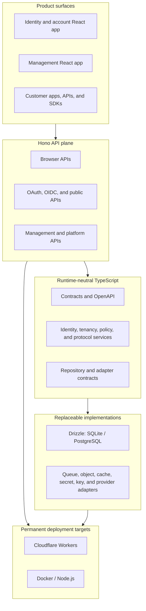

# ExpressThat Auth

A portable, security-first authentication and identity platform for hosted and
self-hosted deployments.

> [!IMPORTANT]
> This repository is in its architecture and engineering-foundation phase. It
> contains binding product decisions and executable compatibility spikes, but
> the complete platform is not implemented or ready for production use.

ExpressThat Auth is intended to provide the authentication capabilities needed
by websites, single-page applications, native applications, APIs, machine
clients, and enterprise products without tying the core platform to one
infrastructure provider.

It will expose three main product surfaces:

- a hosted identity and account experience for sign-up, sign-in, consent,
  recovery, security, sessions, profile, and organisation switching;
- a management dashboard for administrators to manage organisations,
  environments, applications, users, policies, providers, domains, audit,
  privacy, and support operations; and
- strongly typed management, identity, protocol, account, provider, and platform
  APIs with complete OpenAPI 3.1 and Swagger-compatible documentation.

## Product Model

- A permanent protected **system organisation** contains the platform's own
  management application and management identities.
- A management identity can administer any number of **customer organisations**
  through independent memberships and roles.
- Every customer organisation has isolated development, staging, and production
  environments.
- Applications in the same customer organisation and environment share an
  end-user pool. A user must grant application-specific consent when required.
- End users can belong to any number of nested **end-user organisations** and
  switch their active organisation without signing out.
- Customer defaults and application overrides define authentication,
  authorization, claims, branding, and provider behavior.

Management identities and customer end users are separate trust planes with
separate physical storage, credentials, sessions, issuers, and key scopes.

## Design Principles

### Workers and Docker are permanent equal targets

APIs use [Hono](https://hono.dev/) and Web APIs so the same domain and protocol
behavior can run on:

- Cloudflare Workers; and
- Node.js in unprivileged Docker containers.

Frontends use Vite and produce deployable assets for both Workers and Docker.
Runtime parity is tested; a feature is incomplete if it works on only one
target.

Runtime parity means compatible behavior, contracts, security invariants, and
conformance—not identical operational guarantees. Hosted commitments apply only
to infrastructure operated by the hosted service.

### Infrastructure is adapter-based

Core packages depend on contracts rather than provider SDKs. Replaceable
capabilities include:

- queues, jobs, schedulers, object storage, caches, and rate-limit state;
- secrets, encryption, signing-key custody, DNS, and certificates;
- email, SMS, social identity, enterprise SSO, and directory provisioning;
- webhooks, action hooks, risk, bot challenges, observability, and deployment
  automation; and
- database repositories and migrations behind selectable adapters, with Drizzle
  SQLite and PostgreSQL as the initial first-party implementations.

Every adapter declares capabilities, runtime support, configuration and secret
schemas, failure behavior, tenant scope, and residency guarantees. Hosted
acceleration must never become a dependency of the self-hosted product.

### Stateless and horizontally scalable

Deployable services do not keep authoritative cross-request state in process.
Sessions, replay protection, idempotency, rate limits, jobs, locks, key state,
authorization, and caches use shared durable implementations. Multiple API and
worker instances must preserve exactly the same behavior.

### Security is continuous

Every task considers assets, trust boundaries, malicious inputs, authorization,
tenant/environment isolation, races, replay, dependency failure, data exposure,
and abuse. Denied and hostile cases are tested while the behavior is built,
supported by:

- a living threat model and abuse-case register;
- strict runtime validation and defensive programming;
- protocol, property, fuzz, concurrency, and multi-tenant tests;
- dependency, credential, static, artifact, container, and configuration
  scanning;
- continuous dynamic security campaigns; and
- independent architecture review and penetration testing before general
  availability.

There is no default administrator password, vendor master key, reusable setup
credential, or hidden break-glass login.

### Customers and users own their data

The platform does not claim ownership of customer or end-user data.
Administrators will be able to export their organisation's complete logical
dataset without direct database access. End users will have self-service GDPR
access, portability, correction, restriction, objection, consent withdrawal,
and erasure workflows.

Ordinary exports never contain reusable credentials or secrets. Eligible
password-hash migrations use a separate, target-encrypted, high-risk workflow.
Hosted non-public data and platform-controlled processing remain in approved
European Union locations.

### Self-hosted deployments are operator-controlled

Self-hosted operators may use any infrastructure, provider, or region, including
locations outside Europe. They own their deployment's legal compliance,
security, subprocessors, upgrades, capacity, availability, monitoring, backups,
recovery, and data-subject operations.

The open-source project provides software, secure defaults, adapters, validation
tools, and reference topologies. It makes no service promise or guarantee for a
self-hosted installation. Any hosted commitments come only from the hosted
operator's applicable terms, privacy notice, data-processing agreement, support
policy, or customer contract. See the
[hosted and self-hosted responsibility boundary](docs/operations/hosted-self-hosted-responsibility.md).

## Architecture



## Technology

| Area | Choice |
| --- | --- |
| Language | TypeScript |
| Monorepo | pnpm workspaces and Turborepo |
| API | Hono |
| Contracts | Zod-backed routes, inferred types, OpenAPI 3.1 |
| Frontend | Vite, React, HeroUI, Tailwind CSS |
| Database | Pluggable repository adapters; initial Drizzle SQLite and PostgreSQL implementations |
| Formatting and linting | Biome, installed and configured at the workspace root |
| Unit/integration tests | Vitest |
| Browser tests | Playwright |
| Worker tests | Workerd through the Cloudflare Vitest pool |
| Protocol crypto/client primitives | Web Crypto, `jose`, and `oauth4webapi` |
| Deployment | Cloudflare Workers and Docker |

Dependencies are pinned exactly and reviewed before upgrades.

## Repository Layout

The planned Turborepo layout is:

```text
apps/                       deployable APIs and React applications
packages/                   runtime-neutral product and infrastructure packages
packages/providers/         provider adapter implementations
deploy/                     Workers and Docker composition/deployment workspaces
tooling/                    repository tooling and temporary validation spikes
docs/                       ADRs, security, privacy, and operator documentation
```

The `tooling/*-spike` workspaces are temporary executable validation projects.
They currently prove the dual-runtime Hono/OpenAPI contract and portable
Argon2id approaches. Their useful conformance tests will move into production
packages, and the spike workspaces will be removed when those packages replace
them.

The planned local-development profile uses SQLite directly and a single Docker
Compose stack for shared dependencies such as RabbitMQ, S3-compatible object
storage, Valkey, email capture, and OpenTelemetry. Initial
interactive-development adapters connect to those local resources through the
normal contracts; in-process adapters remain test doubles only. PostgreSQL is
reserved for CI production-dialect conformance and optional database testing,
not required for ordinary local development. This is a development convenience,
not the production self-hosted topology.

## Getting Started

New contributors should follow [`CONTRIBUTING.md`](CONTRIBUTING.md) for the
complete task, architecture, defensive-programming, testing, documentation,
review, and commit workflow.

### Prerequisites

- Node.js `>=24.18.0 <27`
- pnpm `11.16.0`
- Git
- Docker for local shared dependencies, container builds, and deployment
  testing as those workspaces are introduced

Enable Corepack if pnpm is not already available:

```bash
corepack enable
corepack prepare pnpm@11.16.0 --activate
```

Install the exact dependency graph:

```bash
pnpm install --frozen-lockfile
```

Run the current repository checks:

```bash
pnpm build
pnpm lint
pnpm typecheck
pnpm test
pnpm test:coverage
```

`pnpm dev` is the root development entry point once deployable application
workspaces are scaffolded. Turborepo can target one workspace with `--filter`,
for example:

```bash
pnpm test --filter @expressthat-auth/hono-contract-spike
```

Package names and commands will evolve while the production workspace replaces
the temporary spikes. The root commands remain the stable developer interface.

## Engineering Rules

Every non-documentation task must satisfy all applicable rules:

- automated tests fail when its behavior is removed or broken;
- executable first-party TypeScript maintains 100% line, statement, function,
  and branch coverage;
- first-party source, test, configuration, migration, and tooling files remain
  at or below 250 physical lines;
- documentation, generated files/migrations, third-party code, lockfiles, and
  machine-generated fixtures use only centrally approved exemptions;
- strict TypeScript, formatting, lint, package-boundary, cycle, schema,
  contract, security, and production-build checks pass;
- tenant tests use at least two tenants, and environment behavior uses multiple
  environments;
- Workers and Docker conformance passes wherever runtime behavior can differ;
- no skipped, focused, quarantined, flaky, or nondeterministic test is accepted;
  and
- every bug fix includes a regression test.

Development is committed continuously. Prefer one completed backlog task per
coherent, tested commit using:

```text
<type>(<area>): <summary> [TASK-ID]
```

The project does not use pull requests as its internal unit of progress.

## Documentation

Start here:

- [Product and architecture overview](AUTH_SOLUTION_OVERVIEW.md)
- [Ordered implementation backlog](IMPLEMENTATION_TASKS.md)
- [Other providers feature overview](OTHER_PROVIDERS_FEATURE_OVERVIEW.md)
- [Architecture Decision Records](docs/decisions/README.md)
- [Changelog](CHANGELOG.md)
- [Release and changelog process](docs/releases/release-process.md)
- [Security policy and private reporting](SECURITY.md)
- [Contributor guide](CONTRIBUTING.md)
- [Documentation-as-code standard](docs/contributing/documentation-standard.md)
- [Task review checklist](docs/contributing/task-review-checklist.md)
- [Workspace ownership and boundaries](docs/architecture/workspace-ownership.md)
- [Living platform threat model](docs/security/threat-model.md)
- [Adversarial testing toolkit](docs/security/adversarial-testing-toolkit.md)
- [Data classification and handling](docs/security/data-classification.md)
- [European residency and transfer map](docs/privacy/european-data-residency.md)
- [Bootstrap and break-glass standard](docs/security/bootstrap-and-break-glass.md)
- [Support access and impersonation standard](docs/security/support-and-impersonation.md)
- [Security and reliability targets](docs/operations/security-reliability-targets.md)
- [Hosted and self-hosted responsibility boundary](docs/operations/hosted-self-hosted-responsibility.md)
- [Protocol and security standards register](docs/security/standards-register.md)

The overview defines the intended product. The backlog is the source of delivery
progress. ADRs are binding until superseded.

## Roadmap

| Milestone | Outcome |
| --- | --- |
| M0 | Engineering foundation, contracts, runtimes, database, quality, and deployment shells |
| M1 | Core organisation, application, sign-up, consent, sign-in, account, and OAuth/OIDC flows |
| M2 | Production authenticators, providers, webhooks, abuse controls, operations, and deployment |
| M3 | End-user organisations, enterprise SSO, SCIM, advanced roles, and controlled support |
| M4 | GDPR operations, scaling, recovery, billing, SDKs, assurance, and general availability |

See [IMPLEMENTATION_TASKS.md](IMPLEMENTATION_TASKS.md) for the complete dependency
graph and current checkboxes.

## License

ExpressThat Auth is open-source software licensed under the
[MIT License](LICENSE).

Copyright (c) 2026 ExpressThat LTD.

The licence covers the software and includes its standard "as is" warranty
disclaimer. It does not create a hosted-service SLA, support commitment, data
residency promise, DPA, or other managed-service obligation. Those can be made
only by the hosted operator through a separate applicable policy or contract.
