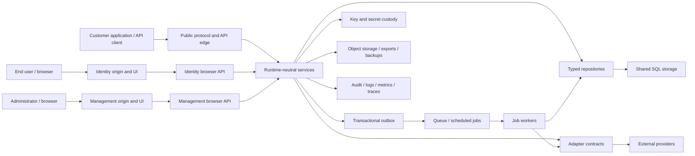

# Platform Threat Model

- **Status:** Living baseline
- **Version:** 1.0
- **Date:** 2026-07-23
- **Owners:** Security engineering with all feature owners
- **Decision:** ADR-0015
- **Review cadence:** continuously on change, quarterly in operation, and before
  every production release

## 1. Purpose and Scope

This model covers the hosted and self-hosted authentication platform, including:

- management and end-user browser applications;
- management, identity, OAuth/OIDC, account, integration, and internal APIs;
- management identities, customer user pools, applications, environments,
  end-user organisations, consent, roles, and sessions;
- social/enterprise federation, SAML, SCIM, webhooks, action hooks, imports,
  exports, privacy workflows, and support impersonation;
- databases, queues, jobs, caches, object storage, secrets, signing keys,
  adapters, audit, observability, backups, and deployment control;
- Cloudflare Workers and Docker/Node runtime profiles; and
- SQLite development/single-instance paths and PostgreSQL horizontally scaled
  production paths.

The model protects confidentiality, integrity, availability, authenticity,
authorization, privacy, tenant isolation, data ownership, portability, and
European residency. Billing-provider internals, customer application code, user
devices, upstream identity providers, networks, and self-hosted infrastructure
are outside direct implementation control but are treated as hostile or fallible
boundaries.

## 2. Method and Risk Handling

Threat discovery uses assets, actors, data flows, trust boundaries, misuse
stories, STRIDE-style categories, privacy harms, and operational failure modes.
Security is assessed at design time and tested continuously under the rules in
the architecture overview and implementation backlog.

### Severity

| Impact | Examples |
| --- | --- |
| Critical | Cross-tenant credential/data compromise; signing-key compromise; remote management takeover; undetected platform-admin impersonation |
| High | Account takeover; production environment escape; bulk personal-data disclosure; durable authorization bypass; destructive integrity loss |
| Medium | Bounded disclosure; single-session compromise; exploitable availability loss; policy bypass requiring strong preconditions |
| Low | Minor metadata leak; quickly recoverable local degradation; hardening gap with no practical exploit path |

Likelihood considers reachability, required access, exploit complexity,
detectability, scale, runtime differences, and existing controls. Findings record
inherent and residual severity, owner, remediation target, affected releases,
control/test evidence, and review date. Critical or high findings block release
unless eliminated; lower accepted risks need explicit owner, reason, expiry, and
monitoring.

## 3. Architecture and Trust Boundaries

### Trust-Boundary Register

| ID | Boundary | Required treatment |
| --- | --- | --- |
| TB-01 | Internet to hosted/custom/self-hosted origin | TLS, verified host/proxy, bounded parsing, authentication, rate limits, safe errors |
| TB-02 | Browser UI to cookie-authenticated API | Same origin, host-only cookies, CSRF token, Origin/Fetch Metadata, output encoding |
| TB-03 | Public client to OAuth/OIDC issuer | Exact client/redirect binding, PKCE, state/nonce, replay prevention, protocol conformance |
| TB-04 | Management plane to customer tenant | Separate issuer/session/store plus current customer membership and trusted context |
| TB-05 | Customer organisation/environment to another | Mandatory typed context, compound repository predicates, separate keys/users/providers |
| TB-06 | End-user identity to application/end-user organisation | Consent, application grant, current membership, active-context binding |
| TB-07 | API/service to SQL database | Parameterised repository methods, transactions, least privilege, encryption, migration control |
| TB-08 | Request transaction to queue/job | Transactional outbox, versioned persisted context, integrity, idempotency, reauthorization |
| TB-09 | Core service to adapter/provider | Capability allow-list, tenant scope, timeout, SSRF defence, secret references, redaction |
| TB-10 | Application to key/secret custody | Purpose-bound handles, non-exportability where possible, least privilege, complete audit |
| TB-11 | Service to cache/rate-limit store | Untrusted acceleration only; tenant/version keys; atomic shared correctness state |
| TB-12 | Service/job to object storage/export | Tenant/environment namespace, encryption, checksum, short delivery, retention, authorization |
| TB-13 | Service to logs/traces/support tools | Data minimisation, structured redaction, access control, European routing, retention |
| TB-14 | Hosted control plane to Workers/containers | Signed artifacts, least-privilege deploy identity, staged rollout, configuration validation |
| TB-15 | Operator to self-hosted deployment | Explicit shared-responsibility boundary, secure defaults, diagnostics, upgrade and recovery guidance |
| TB-16 | Upstream identity/directory provider to callback | Issuer/signature/destination/state/replay checks; claims remain untrusted input |
| TB-17 | Webhook consumer/caller to delivery endpoints | Signature, exact destination, replay/idempotency, SSRF and redirect controls |
| TB-18 | Support/impersonation actor to subject | Separate actor/subject, step-up, scoped approval, notification, expiry, immutable audit |

## 4. Assets

| Class | Assets | Primary harms |
| --- | --- | --- |
| Root authority | Platform admin access, break-glass credentials, deployment identities | Complete service takeover, evidence destruction |
| Cryptographic | Issuer signing keys, encryption keys, peppers, cookie/context keys, webhook keys | Token forgery, bulk decryption, cross-tenant compromise |
| Reusable credentials | Password hashes, passkeys, MFA seeds, recovery codes, API/client/provider secrets | Account/service takeover, offline attack |
| Bearer artifacts | Sessions, codes, refresh/access/ID tokens, invitations, reset/verification links | Impersonation, unauthorized grants, replay |
| Authorization | Memberships, roles, consent, scopes, policies, provider bindings, active context | Privilege escalation, confused deputy |
| Personal data | Profiles, addresses, attributes, identities, devices, security history | Privacy harm, discrimination, regulatory breach |
| Tenant configuration | Applications, callbacks, domains, connections, hooks, templates | Credential redirection, phishing, code/data exfiltration |
| Operational state | Jobs, outbox, idempotency, replay, rate limits, cursors, migrations | Duplicate effects, stale authorization, corruption |
| Evidence | Audit events, security signals, logs, traces, export manifests | Repudiation, investigation failure, secondary disclosure |
| Availability | Login, token, JWKS, management, database, queues, keys, providers | Customer outage, lockout, cascading failure |
| Ownership/portability | Tenant exports, user rights requests, deletion/retention state | Vendor lock-in, incomplete rights, over-deletion or leakage |

## 5. Actors and Capabilities

- **Unauthenticated attacker:** controls requests, origins, headers, timing,
  encodings, network addresses, bot fleets, and public identifiers.
- **Malicious or compromised end user:** holds valid user sessions/tokens and may
  belong to several end-user organisations.
- **Malicious customer administrator:** has legitimate powers in one or more
  customer organisations but not other customers or the platform.
- **Compromised application or machine client:** has a valid client/API
  credential and can exploit excessive scope, redirect, consent, or token rules.
- **Platform administrator/support operator:** has high privilege and may be
  malicious, coerced, careless, or compromised.
- **External provider/subprocessor:** returns malicious, ambiguous, delayed,
  replayed, oversized, privacy-invasive, or inconsistent data.
- **Self-hosted operator:** controls deployment configuration, storage, network,
  keys, and binaries; the product must warn but cannot protect data from its root
  operator.
- **Supply-chain attacker:** compromises a package, build tool, image, action,
  registry, artifact, update channel, or adapter.
- **Infrastructure attacker/failure:** compromises or partitions database,
  cache, queue, object, DNS, certificate, KMS, proxy, Worker binding, container,
  clock, or random source.
- **Researcher/accidental user:** discovers a flaw without hostile intent; intake
  must make safe reporting and rapid containment possible.

## 6. Baseline Security Invariants

1. Management and end-user credentials, sessions, issuers, keys, and stores are
   never accepted across planes.
2. Every tenant-owned read, write, job, cursor, cache key, export, and provider
   effect carries verified customer organisation and environment context.
3. A caller-controlled identifier never grants access; current authorization is
   checked at the effect boundary.
4. Applications share a user pool only inside one customer environment, and
   application access requires consent or a valid administrative grant.
5. Secrets are shown only at creation where required, stored hashed or behind a
   custody handle where possible, never logged, and independently scoped.
6. Authorization codes, refresh tokens, callbacks, invitations, recovery links,
   queue effects, and idempotency records are one-time or replay-controlled.
7. Cryptographic algorithms, keys, issuers, audiences, token types, and purposes
   are allow-listed and bound; caller input cannot select a weaker option.
8. Security state is shared and transactional. Process-local memory and local
   files never provide cross-request correctness in deployable profiles.
9. External failure is bounded and fails closed for authority-changing effects;
   fallback never silently weakens policy or changes provider/custody.
10. Audit retains the real actor and subject, including impersonation and jobs,
    and cannot be changed through ordinary product APIs.
11. Customer and user exports are complete for their authorized scope but omit
    reusable secrets; erasure cannot cross a verified identity/tenant boundary.
12. Hosted personal, credential, evidence, queue, object, log, backup, and key
    processing remains within approved European boundaries.

## 7. Threat and Control Register

### Authentication, Recovery, and Sessions

| ID | Threat / abuse | Inherent | Required controls and evidence | Residual |
| --- | --- | --- | --- | --- |
| AUTH-T01 | Enumeration through sign-in, sign-up, recovery, consent, timing, or rate-limit differences | High | Uniform safe responses, bounded timing, privacy-preserving lookup, coarse rate metadata, multi-account negative tests | Low/Medium timing differences remain measurable at scale |
| AUTH-T02 | Password spraying, stuffing, brute force, breached passwords, or bot sign-up | High | Argon2id, distributed layered limits, risk/challenge, breached-password adapter, notifications, recovery-safe lock behavior | Medium; distributed low-and-slow attacks persist |
| AUTH-T03 | Recovery bypasses MFA or lets attacker replace all factors | Critical | Short one-time artifacts, recent checks, step-up, no last-method removal, notifications, session revocation, state-machine tests | Medium; email/phone account compromise remains external |
| AUTH-T04 | Session fixation, theft, replay, or logout failure | High | Opaque hashed server sessions, host-only cookies, rotation on privilege/context changes, device inventory, shared revocation | Medium on compromised user devices |
| AUTH-T05 | CSRF/login-CSRF/logout-CSRF or cross-origin credential use | High | Same-origin browser API, synchronizer token, exact Origin, Fetch Metadata, non-simple mutations, Lax host-only cookies | Low; browser implementation defects remain |
| AUTH-T06 | XSS steals data or performs actions | High | React escaping, CSP/nonces, Trusted URL handling, no token cookies readable by JS, dependency policy, injection suites | Medium; same-origin XSS can act as the user |
| AUTH-T07 | Passkey/MFA replay, origin/RP confusion, downgrade, cloned factor | High | Exact RP/origin/challenge binding, sign-count/risk handling, assurance policy, no silent downgrade, conformance vectors | Low/Medium depending authenticator behavior |
| AUTH-T08 | Account linking attaches an attacker-controlled upstream identity | High | Current-session step-up, verified upstream transaction, uniqueness/conflict UI, notification, recovery preservation | Medium if upstream provider is compromised |
| AUTH-T09 | Concurrent sign-up/recovery/factor changes violate uniqueness or last-owner/method rules | High | Transactional constraints, optimistic concurrency, idempotency, race campaigns across instances | Low after both-dialect conformance |

### OAuth, OIDC, Federation, and Tokens

| ID | Threat / abuse | Inherent | Required controls and evidence | Residual |
| --- | --- | --- | --- | --- |
| PROTO-T01 | Redirect URI manipulation, mix-up, open redirect, code interception | Critical | Exact registered redirects, issuer identification, state/nonce, S256 PKCE, PAR where required, no implicit/password grants | Low |
| PROTO-T02 | Code/token replay, refresh-family theft, client confusion | Critical | One-time atomic redemption, client/redirect/PKCE binding, rotation and reuse-family revocation, token-type separation | Medium on theft before detection |
| PROTO-T03 | JOSE algorithm/key confusion or invalid claim acceptance | Critical | `jose`, algorithm policy, issuer/audience/azp/type/time validation, distinct key rings, hostile vectors | Low, dependent on library/runtime correctness |
| PROTO-T04 | Consent laundering or excessive claims/scopes | High | Application-specific requested scopes, explicit consent/admin grants, least claims, revocation, first-app rule tests | Low/Medium from deceptive customer descriptions |
| PROTO-T05 | Malicious discovery/JWKS/UserInfo/SSO metadata causes SSRF, key injection, or identity takeover | Critical | Allow-listed protocols, safe fetch adapter, issuer pinning, signature/destination checks, cache bounds, no redirect trust | Medium if an approved upstream is compromised |
| PROTO-T06 | SAML wrapping, replay, recipient/destination, signature, or XML parser attack | Critical | Hardened parser/library, signed assertion/response policy, exact audience/destination, one-time IDs, size/entity limits | Medium until independent conformance |
| PROTO-T07 | SCIM token compromise or malicious provisioning changes roles/users | High | Hashed scoped tokens, network policy, schema validation, idempotency/versioning, mapping preview, immutable audit | Medium; authoritative directory can intentionally remove users |
| PROTO-T08 | Stale JWT roles/memberships survive revocation | High | Short lifetimes, current-state/version checks for sensitive effects, introspection/revocation epochs, no claims-only admin auth | Low/Medium during bounded token lifetime |

### Tenancy and Authorization

| ID | Threat / abuse | Inherent | Required controls and evidence | Residual |
| --- | --- | --- | --- | --- |
| TEN-T01 | IDOR or missing predicate crosses customer organisations | Critical | Typed `TenantContext`, organisation+environment predicates in every repository query, two-tenant tests, safe 404/403 | Low, contingent on enforcement tooling |
| TEN-T02 | Host/header/route/token disagreement selects attacker tenant | Critical | Authoritative resolution and cross-checking from ADR-0012, verified domains/proxies, fail closed and audit | Low |
| TEN-T03 | Environment confusion exposes production to test users, keys, callbacks, or providers | Critical | ADR-0014 isolation, distinct issuers/keys/users/provider bindings, promotion allow-list, cross-environment suites | Low |
| TEN-T04 | Organisation switching merges permissions or tabs race | High | Tab-bound opaque context, current membership check, session/token rotation, active context is not authority | Low |
| TEN-T05 | End-user organisation membership/role escapes application or parent customer | High | Parent/application/current-membership predicates, layered role provenance, token context binding | Low |
| TEN-T06 | Global administrator boolean or shared user record escalates end user | Critical | Separate management storage, protected platform roles, no cross-plane link/promotion | Low |
| TEN-T07 | Role/configuration race grants or preserves forbidden access | High | ETags/versioned policy, transactional membership changes, revocation epochs, audit, concurrency tests | Low/Medium for already issued short tokens |
| TEN-T08 | Tenant export, search, count, cursor, error, or cache leaks another tenant | Critical | Tenant-bound authenticated cursors, explicit counts, safe errors, scoped caches/exports, hostile boundary tests | Low |

### Data, Privacy, and Injection

| ID | Threat / abuse | Inherent | Required controls and evidence | Residual |
| --- | --- | --- | --- | --- |
| DATA-T01 | SQL/NoSQL/template/header/log/command injection | Critical | Runtime schemas, bounded canonical input, parameterised repositories, structured logs, no shell construction, fuzz corpora | Low |
| DATA-T02 | Secrets/tokens/password hashes/private data leak through logs, traces, errors, exports, analytics, or tests | Critical | Data classification, redaction at source/sink, synthetic fixtures, secret scanning, export allow-lists, canary tests | Medium; novel fields require classification |
| DATA-T03 | Ordinary export contains reusable credentials or unsafe links | Critical | Separate readable vs protected migration export, step-up/dual control, target encryption, manifest and short retention | Low |
| DATA-T04 | User rights request discloses/erases another person or conflicts with retention/legal hold | High | Verified identity, per-controller/environment workflow, preview, state machine, lawful exemptions, audit, appeal | Medium from ambiguous identity evidence/legal decisions |
| DATA-T05 | Incomplete tenant export creates lock-in or silent data loss | High | Versioned schemas/manifest/counts/checksums/omissions, restore validation, adapter-neutral formats | Low/Medium until round-trip import matures |
| DATA-T06 | Backups, replicas, logs, queues, objects, support tools, or subprocessors leave Europe | High | Residency capability metadata, deployment validation, EU routing/storage, subprocessor review, continuous evidence | Medium due provider/legal changes |
| DATA-T07 | Unicode/canonicalization ambiguity causes duplicate identity, domain, redirect, or policy bypass | High | Field-specific normalization, preserve display form, collision checks, exact redirect rules, confusable tests | Low/Medium |
| DATA-T08 | Oversized/deep/compressed input or expensive search causes resource exhaustion | High | Edge/body/depth/count/time limits, streaming where safe, costed indexes, quotas, cancellation/backpressure | Medium during distributed attacks |

### Providers, Webhooks, Adapters, and Customer Logic

| ID | Threat / abuse | Inherent | Required controls and evidence | Residual |
| --- | --- | --- | --- | --- |
| EXT-T01 | Configured URL performs SSRF, DNS rebinding, redirect-to-internal, or protocol smuggling | Critical | Central safe-fetch adapter, public-address policy at resolution/connect, redirect revalidation, egress allow-list, timeout/size bounds | Medium in networks without enforceable egress |
| EXT-T02 | Provider returns forged, oversized, malicious, delayed, duplicate, or ambiguous result | High | Strict normalized schemas, timeouts, idempotency, capability-specific failure policy, no raw payload trust/logging | Medium; external correctness is not provable |
| EXT-T03 | Provider credential or tenant binding is substituted across scope | Critical | Secret references, typed environment scope, operator-installed definitions, current binding resolution, no caller provider IDs | Low |
| EXT-T04 | Webhook forgery, replay, secret leak, or duplicate/reordered delivery | High | Per-endpoint signing secret, timestamp/replay window, event IDs, rotation overlap, idempotency, documented ordering | Low/Medium at receiver |
| EXT-T05 | Action hook/customer code escapes sandbox, exfiltrates data, weakens auth, or hangs | Critical | Disabled until isolated runtime exists, capability/egress/time/memory limits, versioning, fail policy, redacted inputs | Medium even with sandbox; strong review required |
| EXT-T06 | Mock/development provider is enabled in production | High | Capability manifest and startup/binding validation, production allow-list, conspicuous audit and tests | Low |
| EXT-T07 | Malicious adapter/plugin or dependency gains broad process authority | Critical | Operator-installed signed allow-list, narrow contracts/credentials, SBOM/provenance, isolation where feasible, review and scanning | Medium; same-process adapters remain privileged |

### Jobs, State, Concurrency, and Availability

| ID | Threat / abuse | Inherent | Required controls and evidence | Residual |
| --- | --- | --- | --- | --- |
| JOB-T01 | Lost outbox event leaves identity change unaudited or undelivered | High | State change and outbox in one transaction, reconciler, lag alerts, failure injection | Low |
| JOB-T02 | Duplicate/replayed job repeats deletion, export, invitation, provider, or webhook effect | High | Persisted idempotency, versioned context, effect ledger, provider reconciliation, duplicate campaigns | Low/Medium for ambiguous external effects |
| JOB-T03 | Queue message changes/loses tenant, actor, purpose, or authorization | Critical | Integrity-protected persisted context, repository reload, current authorization where required, no header authority | Low |
| JOB-T04 | Stale job performs effect after revoke/delete/policy change | High | Resource/version/state precondition at effect boundary, cancellation tombstone, expiry, audit | Low |
| JOB-T05 | Multiple schedulers rotate/delete/export concurrently | High | Distributed lease plus compare-and-swap/idempotency; no process lock | Low |
| JOB-T06 | Queue flood, poison item, retry storm, or dependency outage exhausts service | High | Quotas, backoff/jitter, bounded retries, circuit/bulkhead, dead letter, per-tenant fairness, backpressure | Medium |
| JOB-T07 | Cache loss/staleness becomes authorization bypass | Critical | Database/shared source of truth, bounded/versioned cache, deny/reload on security state, cache-loss tests | Low |
| JOB-T08 | Clock skew or weak randomness breaks expiry/uniqueness/secrets | Critical | Injected secure random/clock contracts, runtime health, skew bounds, test vectors, no insecure fallback | Low/Medium under host compromise |

### Management, Support, and Operations

| ID | Threat / abuse | Inherent | Required controls and evidence | Residual |
| --- | --- | --- | --- | --- |
| OPS-T01 | Platform administrator account takeover | Critical | Mandatory phishing-resistant MFA/passkey, step-up, least privilege, notifications, session controls, anomaly detection | Medium; privileged endpoint compromise remains |
| OPS-T02 | Insider abuses support view/impersonation or hides actor | Critical | Disabled by default, separate permission, approval, reason, scope, actor/subject, notification, expiry, immutable audit | Medium; authorized insider can view permitted data |
| OPS-T03 | Bootstrap/break-glass path becomes permanent bypass | Critical | One-time bootstrap, offline custody, dual control, short expiry, network restriction, mandatory audit/rotation/drill | Medium because emergency authority must exist |
| OPS-T04 | Customer admin deletes last owner, weakens critical policy, or exports protected credentials | High | Last-owner invariants, ETags, step-up, dual approval for high-risk actions, delayed notification, recovery | Low/Medium |
| OPS-T05 | Signing/encryption/cookie master key compromise | Critical | Purpose/tenant rings, non-exportable custody where possible, envelope encryption, least privilege, staged/emergency rotation | High residual blast radius until tokens/keys expire |
| OPS-T06 | Audit tampering, deletion, forgery, or log injection | High | Append-only repository, sequence/hash/checkpoint where applicable, separate access, structured fields, export verification | Low/Medium against database/operator compromise |
| OPS-T07 | Malicious/failed migration corrupts auth data or crosses scope | Critical | Reviewed generated migrations, both-dialect tests, backup/restore, expand-contract rollout, dedicated migration identity | Medium; large rollback can be slow |
| OPS-T08 | Deployment/configuration supply-chain compromise | Critical | Pinned lockfile, signed provenance/artifacts, isolated build, image/dependency scanning, least-privilege deploy, rollback | Medium; upstream build ecosystem remains trusted |
| OPS-T09 | Backup/restore produces forked issuer, stale revocation, lost audit, or key mismatch | Critical | Ordered consistent backup, key custody recovery, restore drills, reconciliation, forced rotation/revocation plan | Medium during regional disaster |
| OPS-T10 | Monitoring/diagnostics reveal secrets or become control API | High | Read-only minimal health, access control, redaction, no raw configuration/handles, separate admin operations | Low |

### Runtime and Browser Differences

| ID | Threat / abuse | Inherent | Required controls and evidence | Residual |
| --- | --- | --- | --- | --- |
| RUN-T01 | Workers and Docker parse hosts, headers, URLs, crypto, streams, or cookies differently | High | Normalize at runtime shell, shared Web API core, differential black-box suite, trusted-proxy tests | Low/Medium after runtime upgrades |
| RUN-T02 | Cloudflare binding or Node API leaks into core and changes correctness | High | Adapter contracts, package boundaries, bundle inspection, equal conformance, no runtime conditionals in domain | Low |
| RUN-T03 | Docker trusts arbitrary forwarded headers or runs privileged/insecure | High | Explicit proxy allow-list, canonical public origins, unprivileged read-only image, dropped capabilities, secure defaults | Medium from operator misconfiguration |
| RUN-T04 | Worker global reuse or Node singleton becomes authoritative cache/session/lock | Critical | No cross-request in-process correctness, static analysis/review, multi-instance and eviction tests | Low |
| RUN-T05 | A single-instance database is used as shared multi-instance production storage | High | Profile capability validation requires a supported shared transactional adapter; PostgreSQL is the initial reference, not the only possible implementation | Low |
| RUN-T06 | Browser cookie/storage/privacy changes break CSRF/SSO or expose session | High | Host-only opaque cookies, no third-party-cookie dependency, browser matrix, fallback interactions, periodic review | Medium due ecosystem change |
| RUN-T07 | Denial of service differs at Worker limits vs container resources | High | Per-profile measured limits, request budgets, queue offload, backpressure, autoscaling/load tests | Medium under provider-wide outage |

## 8. Required Abuse Journeys

Every primary journey has malicious counterparts. At minimum, automated suites
must attempt:

1. sign-up/sign-in/recovery with existing/non-existing identities, Unicode
   aliases, oversized values, concurrent requests, stolen artifacts, and bot
   distribution;
2. authorization with altered client, issuer, redirect, PKCE, nonce, prompt,
   scope, resource, response mode, consent, session, and active organisation;
3. access using valid IDs, cursors, sessions, tokens, API keys, domains, and jobs
   from a second customer and a second environment;
4. administrator and end-user organisation switching in simultaneous tabs while
   membership, role, consent, and application status are revoked;
5. passkey/MFA/link/recovery changes that attempt downgrade or removal of the last
   safe recovery path;
6. federation and directory messages with wrong issuer/signature/destination,
   replayed IDs, wrapping, schema confusion, huge input, and mapping escalation;
7. webhook/provider destinations using loopback, link-local, private, metadata,
   encoded, redirected, rebound, slow, and oversized endpoints;
8. duplicate, reordered, stale, forged, partially completed, and poison jobs
   across multiple instances and dependency failures;
9. support impersonation without permission, approval, step-up, reason, allowed
   target/action, notification, or unaltered actor audit;
10. export/erasure with another tenant/person, protected credentials, legal hold,
    expired links, tampered manifests, retry, cancellation, and object leakage;
11. signing-key rotation/compromise with multiple instances, stale JWKS caches,
    unavailable custody, wrong purpose/issuer, restore, and overlapping releases;
12. malicious headers, paths, query encodings, JSON structures, archives, CSV,
    XML, templates, logs, and provider error payloads against both runtimes.

## 9. Control and Evidence Strategy

Security controls are complete only with durable evidence:

- unit/property tests for state machines, policy, validation, cryptographic
  binding, redaction, and safe failure;
- schema/parser fuzzing with bounded CPU/memory and preserved regression seeds;
- repository conformance on SQLite and PostgreSQL with multiple tenants and
  environments;
- adapter conformance for tenant scope, failure, timeout, duplicate, residency,
  redaction, and capability behavior;
- protocol vectors and OpenID conformance plans with negative cases;
- browser security journeys in Chromium, Firefox, and WebKit;
- black-box differential tests against Workers and built Docker artifacts;
- multi-instance concurrency, replay, fault-injection, load, and soak campaigns;
- static/type/security linting, dependency/secret/license/container/deployment
  scans, SBOM and artifact provenance;
- restore, emergency rotation, break-glass, incident, deletion, and residency
  evidence drills; and
- independent architecture review and penetration testing with verified retest.

Coverage metrics prove execution, not security quality. Security assertions must
verify denied outcomes, absence/redaction, unchanged state, audit evidence, and
no external effect. A test that only checks a status code is insufficient where
state or disclosure matters.

## 10. Residual and Transferred Risks

- A compromised user device, browser extension, email inbox, phone account, or
  upstream identity provider can act within the authority it legitimately
  receives. Step-up, notification, revocation, and least privilege reduce but do
  not eliminate this.
- A malicious self-hosted root operator can read its deployment's data and keys,
  replace binaries, or disable controls. Secure defaults, diagnostics, signed
  releases, and documentation cannot override root control. The operator also
  owns its regions, providers, legal compliance, availability, backups,
  recovery, patching, and incident response; hosted guarantees do not transfer
  to that installation.
- A platform/KMS/database/build administrator or legal authority with sufficient
  access can create exceptional risk. Separation of duties, non-exportable keys,
  immutable external evidence, approval, and transparency reduce the risk.
- Emergency key compromise cannot instantly invalidate artifacts or JWKS cached
  by uncontrolled relying parties. Short lifetimes, rotation, introspection, and
  communication bound the window.
- Global denial-of-service, internet/provider outages, and regional disasters
  can exceed designed capacity or recovery targets.
- External providers may process data outside intended boundaries after a
  configuration, corporate, or legal change. Continuous capability/residency
  review and the ability to replace adapters are required.
- Novel vulnerabilities in runtimes, cryptographic libraries, dependencies,
  browsers, databases, or CPU/hardware are unavoidable; monitoring, rapid
  upgrade, kill switches, and incident response bound exposure.
- Customer administrators can intentionally configure misleading branding,
  scopes, messages, or access within their tenant. Platform minimums,
  transparency, consent, abuse handling, and audit limit harm without becoming
  the customer's business-policy authority.
- Traffic analysis and timing can reveal limited activity metadata even when
  response content is uniform. Rate limits, coarse errors, batching, and
  minimization reduce but cannot remove all side channels.

## 11. Continuous Maintenance

Every task performs a security-impact check. The owner updates this model when a
change adds or alters an asset, actor, entry point, trust boundary, credential,
parser, protocol, privilege, data purpose/class, provider, background effect,
deployment path, or security assumption.

At least quarterly and before production releases:

1. review new standards, advisories, incident lessons, dependency/runtime
   changes, provider/residency changes, and customer abuse;
2. rerank threats using production exposure and control evidence;
3. expire or renew accepted risks and tool suppressions;
4. run scheduled dynamic, fuzz, concurrency, dependency, artifact, and
   infrastructure campaigns;
5. verify critical controls on both Workers and Docker;
6. sample tenant/environment predicates and data-flow/redaction coverage;
7. exercise one high-impact operational procedure; and
8. publish owned remediation work without hiding it in unrelated tasks.

Security incidents update this model, add regression evidence, and reassess
similar trust boundaries. A feature cannot be considered complete while it has
an unowned critical/high threat or relies on an undocumented security
assumption.
