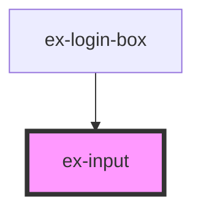

# ex-input

<!-- Auto Generated Below -->

## Properties

| Property                 | Attribute                  | Description                                                     | Type                  | Default     |
| ------------------------ | -------------------------- | --------------------------------------------------------------- | --------------------- | ----------- |
| `colorBackground`        | `color-background`         |                                                                 | `string \| undefined` | `undefined` |
| `colorDivider`           | `color-divider`            |                                                                 | `string \| undefined` | `undefined` |
| `colorError`             | `color-error`              |                                                                 | `string \| undefined` | `undefined` |
| `colorInputBackground`   | `color-input-background`   |                                                                 | `string \| undefined` | `undefined` |
| `colorInputBorder`       | `color-input-border`       |                                                                 | `string \| undefined` | `undefined` |
| `colorInputBorderFocus`  | `color-input-border-focus` |                                                                 | `string \| undefined` | `undefined` |
| `colorLink`              | `color-link`               |                                                                 | `string \| undefined` | `undefined` |
| `colorPrimary`           | `color-primary`            |                                                                 | `string \| undefined` | `undefined` |
| `colorPrimaryForeground` | `color-primary-foreground` |                                                                 | `string \| undefined` | `undefined` |
| `colorPrimaryHover`      | `color-primary-hover`      |                                                                 | `string \| undefined` | `undefined` |
| `colorSurface`           | `color-surface`            |                                                                 | `string \| undefined` | `undefined` |
| `colorText`              | `color-text`               |                                                                 | `string \| undefined` | `undefined` |
| `colorTextMuted`         | `color-text-muted`         |                                                                 | `string \| undefined` | `undefined` |
| `disabled`               | `disabled`                 | Disables the input.                                             | `boolean`             | `false`     |
| `error`                  | `error`                    | Validation error message shown below the input.                 | `string \| undefined` | `undefined` |
| `fontFamily`             | `font-family`              |                                                                 | `string \| undefined` | `undefined` |
| `fontSizeLg`             | `font-size-lg`             |                                                                 | `string \| undefined` | `undefined` |
| `fontSizeMd`             | `font-size-md`             |                                                                 | `string \| undefined` | `undefined` |
| `fontSizeSm`             | `font-size-sm`             |                                                                 | `string \| undefined` | `undefined` |
| `fontSizeXl`             | `font-size-xl`             |                                                                 | `string \| undefined` | `undefined` |
| `fontSizeXs`             | `font-size-xs`             |                                                                 | `string \| undefined` | `undefined` |
| `fontWeightMedium`       | `font-weight-medium`       |                                                                 | `string \| undefined` | `undefined` |
| `fontWeightNormal`       | `font-weight-normal`       |                                                                 | `string \| undefined` | `undefined` |
| `fontWeightSemibold`     | `font-weight-semibold`     |                                                                 | `string \| undefined` | `undefined` |
| `inputId`                | `input-id`                 | Associates the label with the input.                            | `string \| undefined` | `undefined` |
| `label`                  | `label`                    | Visible label above the input.                                  | `string \| undefined` | `undefined` |
| `placeholder`            | `placeholder`              | Placeholder text.                                               | `string \| undefined` | `undefined` |
| `radiusLg`               | `radius-lg`                |                                                                 | `string \| undefined` | `undefined` |
| `radiusMd`               | `radius-md`                |                                                                 | `string \| undefined` | `undefined` |
| `radiusSm`               | `radius-sm`                |                                                                 | `string \| undefined` | `undefined` |
| `radiusXl`               | `radius-xl`                |                                                                 | `string \| undefined` | `undefined` |
| `rightButtonLabel`       | `right-button-label`       | Label for an optional right-side button (e.g. "Show" / "Hide"). | `string \| undefined` | `undefined` |
| `type`                   | `type`                     | Input type (text, email, password, etc.).                       | `string`              | `"text"`    |
| `value`                  | `value`                    | Controlled value.                                               | `string`              | `""`        |

## Events

| Event                | Description                                                   | Type                  |
| -------------------- | ------------------------------------------------------------- | --------------------- |
| `exChange`           | Fired when the value changes; detail is the new string value. | `CustomEvent<string>` |
| `exRightButtonClick` | Fired when the right button is clicked.                       | `CustomEvent<void>`   |

## Shadow Parts

| Part             | Description |
| ---------------- | ----------- |
| `"input"`        |             |
| `"right-button"` |             |

## Dependencies

### Used by

 - [ex-login-box](../ex-login-box)

### Graph

----------------------------------------------

*Built with [StencilJS](https://stenciljs.com/)*
