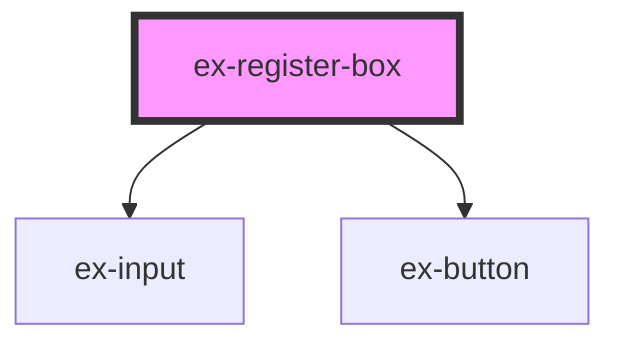

# ex-register-box

<!-- Auto Generated Below -->

## Properties

| Property                 | Attribute                  | Description | Type                  | Default     |
| ------------------------ | -------------------------- | ----------- | --------------------- | ----------- |
| `colorBackground`        | `color-background`         |             | `string \| undefined` | `undefined` |
| `colorDivider`           | `color-divider`            |             | `string \| undefined` | `undefined` |
| `colorError`             | `color-error`              |             | `string \| undefined` | `undefined` |
| `colorInputBackground`   | `color-input-background`   |             | `string \| undefined` | `undefined` |
| `colorInputBorder`       | `color-input-border`       |             | `string \| undefined` | `undefined` |
| `colorInputBorderFocus`  | `color-input-border-focus` |             | `string \| undefined` | `undefined` |
| `colorLink`              | `color-link`               |             | `string \| undefined` | `undefined` |
| `colorPrimary`           | `color-primary`            |             | `string \| undefined` | `undefined` |
| `colorPrimaryForeground` | `color-primary-foreground` |             | `string \| undefined` | `undefined` |
| `colorPrimaryHover`      | `color-primary-hover`      |             | `string \| undefined` | `undefined` |
| `colorSurface`           | `color-surface`            |             | `string \| undefined` | `undefined` |
| `colorText`              | `color-text`               |             | `string \| undefined` | `undefined` |
| `colorTextMuted`         | `color-text-muted`         |             | `string \| undefined` | `undefined` |
| `fontFamily`             | `font-family`              |             | `string \| undefined` | `undefined` |
| `fontSizeLg`             | `font-size-lg`             |             | `string \| undefined` | `undefined` |
| `fontSizeMd`             | `font-size-md`             |             | `string \| undefined` | `undefined` |
| `fontSizeSm`             | `font-size-sm`             |             | `string \| undefined` | `undefined` |
| `fontSizeXl`             | `font-size-xl`             |             | `string \| undefined` | `undefined` |
| `fontSizeXs`             | `font-size-xs`             |             | `string \| undefined` | `undefined` |
| `fontWeightMedium`       | `font-weight-medium`       |             | `string \| undefined` | `undefined` |
| `fontWeightNormal`       | `font-weight-normal`       |             | `string \| undefined` | `undefined` |
| `fontWeightSemibold`     | `font-weight-semibold`     |             | `string \| undefined` | `undefined` |
| `radiusLg`               | `radius-lg`                |             | `string \| undefined` | `undefined` |
| `radiusMd`               | `radius-md`                |             | `string \| undefined` | `undefined` |
| `radiusSm`               | `radius-sm`                |             | `string \| undefined` | `undefined` |
| `radiusXl`               | `radius-xl`                |             | `string \| undefined` | `undefined` |

## Events

| Event      | Description                                                         | Type                                     |
| ---------- | ------------------------------------------------------------------- | ---------------------------------------- |
| `exSignIn` | Fired when the "Sign in" link is clicked.                           | `CustomEvent<void>`                      |
| `exSubmit` | Fired when the form is submitted; detail contains email + password. | `CustomEvent<EXRegisterBoxSubmitDetail>` |

## Shadow Parts

| Part        | Description |
| ----------- | ----------- |
| `"sign-in"` |             |

## Dependencies

### Depends on

- [ex-input](../ex-input)
- [ex-button](../ex-button)

### Graph

----------------------------------------------

*Built with [StencilJS](https://stenciljs.com/)*
